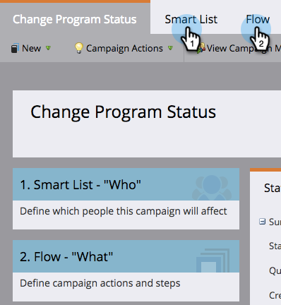

# Skapa en batchsmart kampanj i programschemavy {#creating-a-batch-smart-campaign-in-the-program-schedule-view}

Du kan skapa nya smarta kampanjer och [köra om befintliga](/help/marketo/product-docs/core-marketo-concepts/programs/program-schedule-view/rerun-a-smart-campaign-in-the-program-schedule-view.md) i programmet från programschemavyn.

>[!NOTE]
>
>Det går bara att skapa batchsmarta kampanjer i den här vyn. Utlösarkampanjer stöds inte.

1. Välj vilket datum du vill att din nya smarta kampanj ska köras.

   

1. Välj ett namn för tävlingsbidraget, som blir din nya smarta kampanj. Tryck på **Enter/Return**-tangenten för att bekräfta namnet.

   

1. Klicka på listrutan **Typ** och välj **Smart Campaign**.

   

   >[!NOTE]
   >
   >Du kan också köra en befintlig smart kampanj genom att välja den i listrutan.

   

1. Välj dina [smarta kampanjregler](/help/marketo/product-docs/core-marketo-concepts/smart-campaigns/creating-a-smart-campaign/create-a-new-smart-campaign.md).

   

1. Den här smarta kampanjen visas nu som bekräftad i schemavyn och i informationen om tävlingsbidraget.

   

Detta skapar en ny smart kampanjkörning i programmet.
