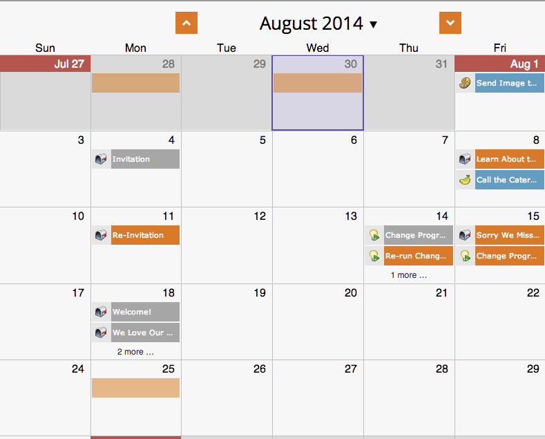

# Skapa anpassade övertäckningar i programschemavy {#creating-custom-overlays-in-program-schedule-view}

Du kan skapa anpassade övertäckningar för att visa poster som är relevanta för dina behov.

1. Klicka på listrutan **Dagordning**.

   

1. Välj **Övertäckningar**.

   

1. Markera de posttyper som du vill ska vara synliga i övertäckningen.

   

1. Du kan också filtrera efter [programtaggar](../../../../product-docs/core-marketo-concepts/programs/working-with-programs/understanding-tags/use-tags-in-a-program.md).

   

   Häftig. Nu visas bara de poster som du har definierat i övertäckningen.

   

