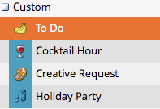

# Dölja och dölja anpassade posttyper {#hiding-and-unhiding-custom-entry-types}

Anpassade posttyper kan döljas i administratörsavsnittet. När posten är dold visas den inte längre som ett alternativ.

## Dölj en anpassad posttyp {#hide-a-custom-entry-type}

1. Gå till avsnittet **Admin** och klicka på **Kalenderposter** **av****typ**.

   

1. Högerklicka på den anpassade posten och klicka på **Dölj**.

   

   Häftig. Den här posttypen kommer inte längre att vara tillgänglig för användning.

## Visa en anpassad posttyp {#unhide-a-custom-entry-type}

Om du vill visa en anpassad posttyp är det också enkelt.

1. Högerklicka på posten och välj **Visa**.

   

   Ta-da! Din anpassade anmälningstyp är nu inte dold.

   

