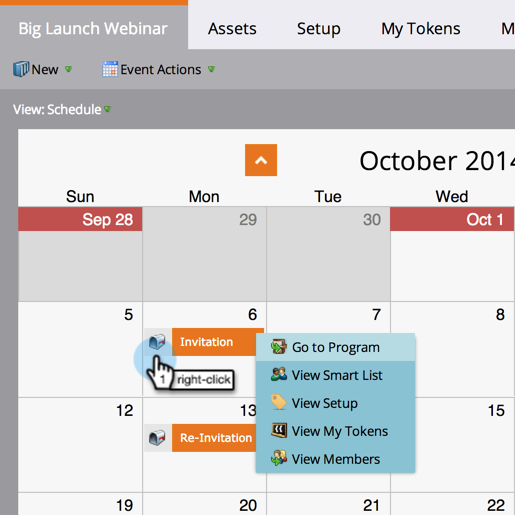

# Navigera i programschemavy {#navigating-the-program-schedule-view}

Här är grunderna som hjälper dig att navigera i programschemavyn.

## Hitta schemavy {#find-the-schedule-view}

1. Gå till **Marknadsföringsaktiviteter**.

   

1. Välj program. Klicka på listrutan **Visa**. Välj **Schema**.

   

   Nu ska vi titta på schemaläggningen av ditt program.

   

>[!NOTE]
>
>Vyn för programschemat är fast. När du har angett det används schemavyn som standard för alla program.

## Växla mellan poster {#switching-between-entries}

1. Klicka på pilarna i informationen om inlägget för att gå till nästa schemalagda inmatning.

   

   Ganska coolt, va?

   

## Snabbmenyn Visa {#view-context-menu}

1. Högerklicka på ett program för att göra ändringar i Programmet, Smart List, Setup, My Tokens eller Members.

   

## Ändra mellan lägen {#changing-between-modes}

1. Om du klickar på **3 veckor** eller **månad** ändras de synliga datumen på skärmen.

   

## Helskärmsläge {#full-screen-view}

1. Du kan klicka på skärmikonen i det övre högra hörnet om du vill visa programschemat i helskärmsläge.

   

Bra! Nu när du vet hur man visar programmet kan vi lära oss andra coola saker som man kan göra.

>[!MORELIKETHIS]
>
>[Skapa ett inlägg i programschemavy](/help/marketo/product-docs/core-marketo-concepts/programs/program-schedule-view/creating-an-entry-in-the-program-schedule-view.md)
