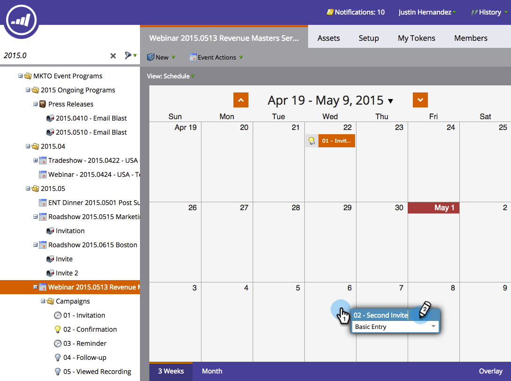

# Kör en smart kampanj igen i programschemavy {#rerun-a-smart-campaign-in-the-program-schedule-view}

Du kan enkelt skapa nya körningar av en befintlig smart kampanj direkt från programschemavyn.

1. Gå till **Marknadsföringsaktiviteter**.

   

1. Välj ett program som innehåller din smarta kampanj.

   

1. I schemavyn klickar du på den dag du vill ställa in din nya körningsversion för och ger ditt bidrag ett namn som är lätt att förstå (t.ex. &quot;Andra inbjudan&quot;).

   

1. Välj listrutan för typ av menyalternativ och välj den smarta kampanj som du vill köra igen.

   

   >[!TIP]
   >
   >Du kan även göra detta från [programfokus](../../../../product-docs/core-marketo-concepts/marketing-calendar/understanding-the-calendar/understand-enable-program-focus.md).

Boom! På samma sätt har du schemalagt en ny körning för den smarta kampanjen. Om den smarta kampanjen innehöll e-poststeg för att skicka dem ser du även dem!