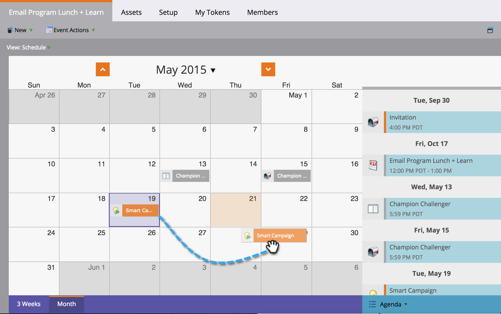

# Schemalägg om en batchvis smart kampanj i programschemavy {#reschedule-a-batch-smart-campaign-in-the-program-schedule-view}

Vill du schemalägga om en batchsmart kampanjkörning? Dra och släpp dem i framtiden i programschemavyn.

1. Välj den smarta kampanj som du vill schemalägga om.

   

1. Dra och släpp till det nya datum som du vill att kampanjen ska köras. 

1. Bra! Den smarta kampanjen har planerats om. Tiden kan också ändras från **listrutan Datum** i informationen om posten.

   

>[!NOTE]
>
>**Relaterade artiklar**
>
>[Schemalägga om ett helt program från schemaläggningsvyn](rescheduling-an-entire-program-from-the-schedule-view.md)

