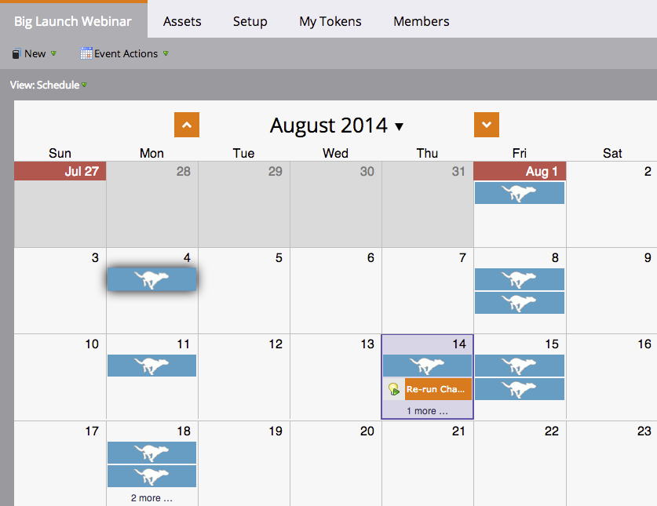

# Schemalägga om ett helt program från schemaläggningsvyn {#rescheduling-an-entire-program-from-the-schedule-view}

När du klonar ett program eller en händelse med datum, vill du troligtvis schemalägga om alla datum samtidigt. Så här gör du.

1. Välj det program som du vill schemalägga om.

   

1. Välj listrutan Händelseåtgärd. Välj **Schemalägg om transaktioner**.

   

1. Markera en ankarpunktspost. Baserat på den här flytten flyttas alla andra poster tillsammans med den.

   

1. Välj det nya startdatumet.

   

1. Klicka **Schemalägg om**.

   

1. Våra datahämtare kommer sedan att ta bort godkännanden, schemalägga om och omgodkänna alla dina resurser med rätt datum!

   

>[!NOTE]
>
>Resurser som redan har körts flyttas inte.

Allt är nu omplanerat. Justera eventuella specifika datum efter behov.

