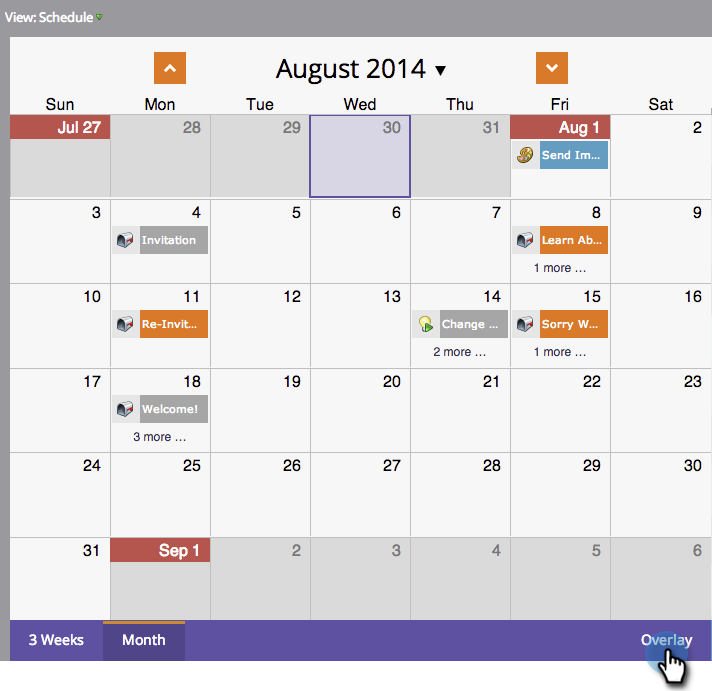

# Använda en global övertäckning {#using-a-global-overlay}

Med den globala övertäckningen i programschemavyn kan du se programmet i relation till andra schemalagda resurser.

>[!PREREQUISITES]
>
>Du måste ha en [licens för marknadsföringskalendern](/help/marketo/product-docs/core-marketo-concepts/marketing-calendar/understanding-the-calendar/issue-revoke-a-marketing-calendar-license.md) för att kunna använda den här funktionen.

## Använd den globala övertäckningen {#use-the-global-overlay}

1. Välj program.

   

1. Välj **Övertäckning** i det nedre högra hörnet.

   

1. De heldragna blocken representerar poster på det datumet. Klicka för att se information.

   

   Posten för överläggsobjekt är skrivskyddad. Klicka på det överordnade programmet för att göra ändringar.

   

## Använd ett sparat filter som övertäckning {#use-a-saved-filter-as-an-overlay}

Om du har [sparat ett filter i marknadsföringskalendern](/help/marketo/product-docs/core-marketo-concepts/marketing-calendar/working-with-the-calendar/saving-a-filter-definition-in-the-marketing-calendar.md) kan du använda det som en övertäckning i programschemavyn.

1. Klicka på listrutan **Övertäckning** och välj filterdefinitionen.

   

   Så enkelt! Nu visas en övertäckning som definieras av filtret som du har sparat och markerat.

   

   >[!MORELIKETHIS]
   >
   >[Skapa anpassade övertäckningar i programschemavy](/help/marketo/product-docs/core-marketo-concepts/programs/program-schedule-view/creating-custom-overlays-in-program-schedule-view.md)
