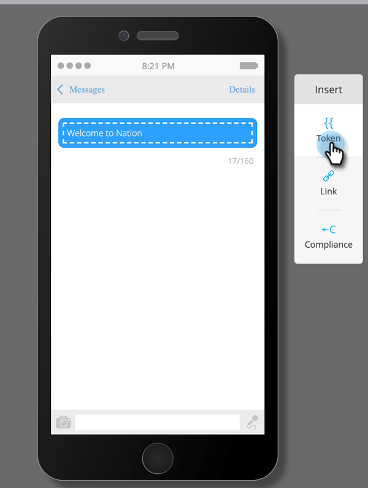
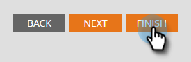

# Anpassade fälttoken för programmedlem {#program-member-custom-field-tokens}

## Token Support för anpassade programmedlemsfält {#token-support-for-program-member-custom-fields}

På baksidan av funktionerna för anpassade fält för programmedlemmar utökas stödet för anpassade fält för programmedlemmar i tokenramverk.

PMCF-token stöds under medlemsdomänen för tokens-familjen.

Medlemstoken används för fält som omfattas av programmedlemmens tillämpningsområde. I nuläget används medlemstoken även för att infoga unika värden från integrerade tjänstpartner. `{{member.webinar url}}` -token löser automatiskt personens unika bekräftelse-URL som genereras av tjänsteleverantören. {{member.registration code}} matchar registreringskoden som tillhandahålls av tjänsteleverantören.

>[!NOTE]
>
>* Anpassade fält för programmedlemmar kan bara användas i ett program.
>* Det går inte att använda token för anpassade fält för programmedlemmar i: e-postförhuvud, datumtoken i väntesteg eller kodfragment.
>* Programmedlemmens status stöds inte i medlemstoken.

## Använda token för anpassade fält för programmedlemmar i resurser {#using-program-member-custom-field-tokens-in-assets}

Du kan infoga token för anpassade fält för programmedlemmar i e-postmeddelanden, landningssidor, SMS, push-meddelanden och webhooks.

**E-post**

1. Markera önskat e-postmeddelande och klicka på **Redigera utkast**.

   

1. Klicka på ikonen Infoga token.

   

1. Sök efter och välj önskad token för anpassat fält för programmedlem, ange ett standardvärde och klicka på **Infoga**.

   

1. Klicka på **Spara**.

   

>[!NOTE]
>
>Glöm inte att godkänna e-postmeddelandet.

**Landningssidor**

1. Välj landningssida och klicka på **Redigera utkast**.

   

   >[!NOTE]
   >
   >Designern för landningssidan öppnas i ett nytt fönster.

1. Dubbelklicka på textrutan där du vill lägga till variabeln.

   

1. Klicka där du vill att token ska vara och klicka sedan på ikonen Infoga token.

   

1. Sök efter och välj önskad token.

   

1. Ange ett standardvärde och klicka på **Infoga**.

   

1. Klicka på **Spara**.

   

**SMS**

1. Välj önskat SMS och klicka på **Redigera utkast**.

   

1. Klicka på knappen **`{{ Token`**.

   

1. Sök efter och välj önskad token för anpassat fält för programmedlem. Ange ett standardvärde och klicka på Infoga.

   

1. Klicka på listrutan SMS-åtgärder och välj **Godkänn och stäng**.

   

**Push-meddelanden**

1. Markera önskat push-meddelande och klicka på **Redigera utkast**.

   

1. Klicka på **Push Notification**.

   

1. Klicka på meddelandet i redigeraren och klicka på knappen `{{` för att hämta tokenväljaren.

   

1. Sök efter och välj önskad token för anpassat fält för programmedlem. Ange ett standardvärde och klicka på **Infoga**.

   

1. Klicka på **Slutför** om du vill spara och avsluta (eller **Nästa** om du vill granska först).

   

>[!NOTE]
>
>Om det anpassade fältet Programmedlem för en medlem i programmet inte har något värde ersätts variabeln med standardvärdet om det har angetts.

## Använda token för anpassade fält för programmedlemmar i kampanjer {#using-program-member-custom-field-tokens-in-campaigns}

Anpassade fälttoken för programmedlem kan användas i:

* Skapa uppgift
* Skapa uppgift i Microsoft
* Intressanta ögonblick
* Ändra flödesåtgärder för datavärde
* Webhooks
