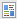

# Förstå Mina token i ett program {#understanding-my-tokens-in-a-program}

En variabel är en variabel som du kan använda i e-postmeddelanden, landningssidor och smarta kampanjer för att göra livet enklare.

Förutom Mina token kan du även använda alla inbyggda tokens i dina program. Ta en titt på [Översikt över token](/help/marketo/product-docs/demand-generation/landing-pages/personalizing-landing-pages/tokens-overview.md).

## Mina token {#my-tokens}

Mina token är anpassade variabler som alla kan skapa. De [skapas](/help/marketo/product-docs/core-marketo-concepts/programs/tokens/managing-my-tokens.md) antingen i kampanjmappar eller i program.

Mina token visas så här: `{{my.Name Of Token}}`

Exempel:

* `{{my.Event Date}}`
* `{{my.Webinar Speaker}}`

<table> 
 <thead> 
  <tr> 
   <th>Tokentyp</th> 
   <th>Beskrivning</th> 
  </tr> 
 </thead> 
 <tbody> 
  <tr> 
   <td>Kalenderfil </td> 
   <td>Använd denna token för att <a href="/help/marketo/product-docs/email-marketing/general/functions-in-the-editor/create-a-calendar-event-ics-file.md">lägga till en kalenderhändelsefil (.i</a><a href="/help/marketo/product-docs/email-marketing/general/functions-in-the-editor/create-a-calendar-event-ics-file.md">cs)</a> till e-postmeddelanden och landningssidor.</td> 
  </tr> 
  <tr> 
   <td>
Datum 
</td> 
   <td>Denna token innehåller ett datumvärde. Datumet visas som årsdag (t.ex. 2016-05-23).</td> 
  </tr> 
  <tr> 
   <td>E-postskript </td> 
   <td>Använd denna token för att köra ett Velocity-skript i dina e-postmeddelanden. Läs mer <a href="http://developers.marketo.com/documentation/email-scripting/" title="Följ länk" rel="nofollow">här</a>. </td> 
  </tr> 
  <tr> 
   <td>Number </td> 
   <td>Ett heltal. Den kan till och med vara negativ.</td> 
  </tr> 
  <tr> 
   <td>RTF </td> 
   <td>Det här är HTML. Använd det i e-postmeddelanden och på landningssidor.</td> 
  </tr> 
  <tr> 
   <td>Poäng </td> 
   <td>Använd den här token i <a href="/help/marketo/product-docs/core-marketo-concepts/smart-campaigns/flow-actions/use-tokens-in-flow-steps.md">steget för att ändra poängflödet</a>. </td> 
  </tr> 
  <tr> 
   <td colspan="1">SFDC-kampanj </td> 
   <td colspan="1">Använd denna token för att tillåta att leads som blir en del av ett Marketo-program även läggs till i det SFDC-kampanjer som läggs till.</td> 
  </tr> 
  <tr> 
   <td>Text </td> 
   <td>Bara lite text. Använd det när HTML är överdrivet. Storleksgränsen för texttoken är 524 288 tecken (UTF-8), eller 2 MB.</td> 
  </tr> 
 </tbody> 
</table>

>[!CAUTION]
>
>Mina token kommer inte att matchas när du skickar ett e-postmeddelande från Sales Insight på antingen Microsoft Dynamics eller Salesforce. endast standardtokens fylls i (Lead, Company, etc.). Standardvärden för variabler _fungerar_.

## Kapslade token {#nesting-tokens}

När du skapar en ny token kan andra objekt i trädet referera till den. Det finns en namngivningsstruktur där token skapades för enkel hantering.

* **Lokal token:** Token skapades direkt i programmet eller mappen.
* **Ärvd token:** Token skapades upp trädet någonstans i ett program eller en mapp på en högre nivå.
* **Åsidosatt token:** Token ärvdes och någon gjorde sedan ett undantag i det här programmet eller den här mappen.

Du kan göra globala variabler och sedan åsidosätta dem på lägre nivåer i trädet.

När du flyttar program och mappar påverkas även tokens. Kontrollera alltid för att se till att referenser inte bryts under flyttningen.

>[!NOTE]
>
>Om e-postmeddelandet som du skickar från ett engagemangsprogram är en underordnad e-postadress till ett standardprogram (inte lokal till ditt engagemangsprogram) matchas alla Mina token som används i e-postmeddelandet från standardprogrammet där den underordnade e-postadressen finns.

>[!MORELIKETHIS]
>
>* [Översikt över token](/help/marketo/product-docs/demand-generation/landing-pages/personalizing-landing-pages/tokens-overview.md)
>* [Hantera mina token](/help/marketo/product-docs/core-marketo-concepts/programs/tokens/managing-my-tokens.md)

