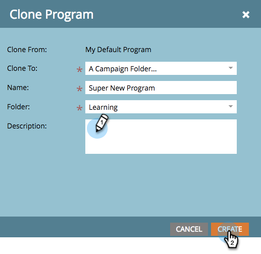

# Klona ett program {#clone-a-program}

Du kan snabbt och enkelt klona ett helt program och alla dess resurser i stället för att manuellt återskapa allt. Så här gör du.

1. Sök efter och välj det program du vill klona och klicka sedan på **Klona under** Programåtgärder **.**

   

1. Välj var du vill klona programmet.

   >[!NOTE]
   >
   >Program kan klonas till [kampanj](/help/marketo/product-docs/core-marketo-concepts/miscellaneous/create-new-campaign-folder.md) [mappar](/help/marketo/product-docs/core-marketo-concepts/miscellaneous/create-new-campaign-folder.md) eller [arbetsytor](/help/marketo/product-docs/administration/workspaces-and-person-partitions/create-a-new-workspace.md). Se till att du delar alla underliggande beroende resurser (e-post, kodavsnitt, mallar för landningssidor osv.) med målarbetsytan innan du klonar.

   

   >[!NOTE]
   >
   >Ser du NOTE i skärmbilden ovan? Det innebär att om du klonar ett program med 1 000 eller fler personer i en lista kommer själva listan att klonas, men den kommer att vara tom. Om du klonar ett program med en lista som innehåller 999 personer eller mindre visas den listan tillsammans med alla dess medlemmar i det klonade programmet.

1. Ange ett namn.

   

1. Välj den mapp som du vill klona programmet till.

   

1. Lägg till en valfri beskrivning och klicka sedan på **Skapa**. Se hur snabbt du kunde skapa ett nytt program med allt material redo att användas!

   

   >[!TIP]
   >
   >Använd den här tekniken tillsammans med variabler för att skapa nya program på ett kick.

   >[!CAUTION]
   >
   >Periodkostnaderna överförs inte över, så lägg till dem i ditt klonade program om du hade en uppsättning i originalet.
