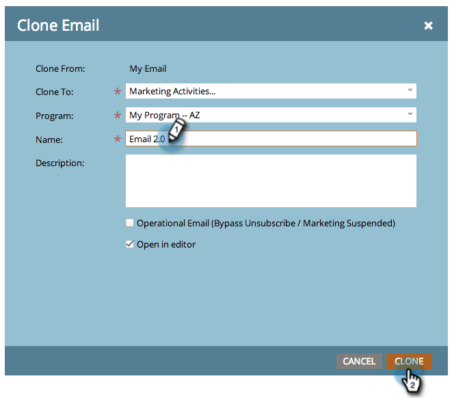

# Klona en resurs i ett program {#clone-an-asset-in-a-program}

Klona ett program klonar *allt*. Ibland vill du bara klona en resurs. Så här gör du.

>[!NOTE]
>
>Du måste utföra ytterligare steg för att [klona en testgrupp för landningssidor](../../../../product-docs/demand-generation/landing-pages/landing-page-actions/cloning-a-landing-page-test-group.md).

## Klona en lokal resurs {#clone-a-local-asset}

1. Gå till **Marknadsföring** **Aktiviteter**.

   

1. Välj program.

   

1. Högerklicka på den lokala resurs som du vill klona. Klicka på **Klona**.

   

1. Varje typ av resurs har en egen dialogruta. Fyll i informationen och klicka på **Klona.**

   

   >[!TIP]
   >
   >Du kan också klona en resurs till ett annat program. Använd listrutan **Program** för att göra ditt val.

1. Bra! Du bör nu se den nya klonade resursen.

   

   >[!NOTE]
   >
   >**Relaterade artiklar**
   >
   >    
   >    
   >    * [Klona ett program](clone-a-program.md)

