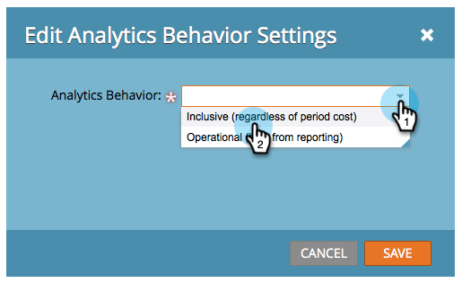

# Redigera inställningar för analysbeteende {#edit-analytics-behavior-settings}

Du kan ställa in [analysbeteendet på adminnivå i kanalerna](/help/marketo/product-docs/reporting/revenue-cycle-analytics/program-analytics/make-a-program-without-a-period-cost-available-in-revenue-explorer-and-analyzers.md){target="_blank"}, men du kan även redigera det på programnivå. Så här gör du.

1. Gå till **[!UICONTROL Marketing Activities]**.

   

1. Hitta och välj program.

   

1. Dra **[!UICONTROL Setup]** till arbetsytan på fliken [!UICONTROL Analytics Behavior].

   

1. Välj önskat analysbeteende.

   

>[!NOTE]
>
>**Definition**
>
>**[!UICONTROL Inclusive]** - Det här alternativet ser till att programmet är tillgängligt för rapportering i intäktsutforskaren och analytiker oavsett om du har inkluderat en periodkostnad eller inte.
>
>**[!UICONTROL Operational]** - Det här alternativet gör att programmet inte visas i någon av intäktsutforskarna eller analysatorerna.

>[!NOTE]
>
>Standardbeteendet (om den här inställningen inte används) är att programmet endast inkluderas i Analytics om det finns minst en periodkostnad, även en med noll dollar tilldelat.

1. Klicka på **[!UICONTROL Save]**.

   

Snyggt gjort! Nu vet ni hur man åsidosätter analysbeteendet på programnivå.

>[!NOTE]
>
>Ändringarna kommer att träda i kraft nästa dag och programmet kommer antingen att göras tillgängligt eller dras ut ur intäktsutforskaren och analysatorerna.
