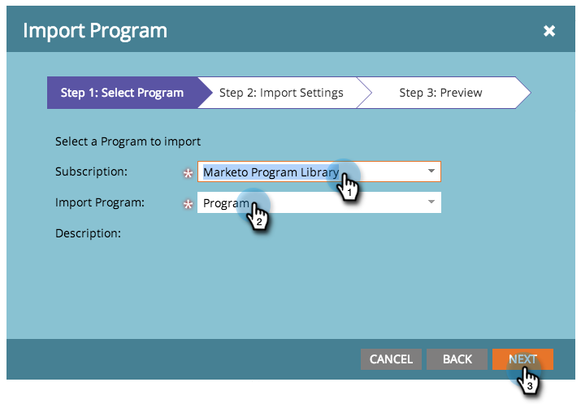

# Importera ett program {#import-a-program}

Ett program kan importeras från en Marketo-prenumeration till en annan. Du kan till exempel skapa ett program i en sandlåda och sedan importera det till din liveprenumeration. Du kan även importera ett färdigbyggt program från Marketo Program Library.

>[!NOTE]
>
>**FYI**
>
>Marketo standardiserar nu språk för alla prenumerationer, så du kan se lead/leads i din prenumeration och person/personer på docs.marketo.com. Dessa termer betyder samma sak. det påverkar inte artikelinstruktionerna. Det finns andra förändringar också. [Läs mer](http://docs.marketo.com/display/DOCS/Updates+to+Marketo+Terminology).

## Importera ett program {#import-a-program-1}

1. Gå till **marknadsföringsaktiviteter.**

   

1. Klicka på **Ny **nedrullningsbar listruta. Välj **Importera program**.

   

   >[!NOTE]
   >
   >Programimport är bara tillgängligt för användare som har roller med behörigheten Importera program aktiverad. Läs mer om hur du [hanterar användarroller och behörigheter](../../../../product-docs/administration/users-and-roles/managing-user-roles-and-permissions.md).
   >
   >
   >Om du vill ansluta ett sandlådekonto till din liveprenumeration kontaktar du [Marketo Support](http://www.marketo.com/services/support/).

1. Välj en Marketo- **prenumeration** och ett program som ska importeras. Klicka på **Nästa**.

   

1. Ange en **kampanjmapp** för det importerade programmet. Klicka på **Nästa.**

   

   >[!NOTE]
   >
   >Se till att** ****Använd standardregler för konflikter** är markerat. Konfliktregler behövs när du importerar program till en instans som har resurser med samma namn.

1. Förhandsgranska information och **Importera** programmet.

   

   En dialogruta visar programmets importförlopp.

   

Du får en bekräftelse via e-post när importen är klar.

>[!NOTE]
>
>Ni måste planera om importerade batchkampanjer och aktivera utlösarkampanjer. Systemet inaktiverar automatiskt kampanjscheman och utlöser kampanjer i det importerade programmet.

## Identifiera färdiga program i Marketo Program Library {#identify-pre-built-programs-in-the-marketo-program-library}

Marketo Program Library innehåller färdiga testade program som du kan importera till din prenumeration. Tillgängliga program:

1. **Grundläggande droppstruktur.** Skickar en serie e-postmeddelanden avgränsade med väntesteg.
1. **Datahantering.** Bevarar dataintegriteten med smarta kampanjer.
1. **E-post med landningssida.** Skickar ett första e-postmeddelande med ett erbjudande, till exempel&quot;ladda ned rapporten&quot;. Följer med ett bekräftelsemeddelande eller påminnelsemeddelande via e-post. Innehåller en landningssida med ett formulär.
1. **E-post med progressionsstatus.** Skickar ut en e-postutsändning med en spårbar länk som personen kan klicka på. Uppdaterar status för varje person - Skickat, Öppnat, Klickat osv.
1. **Intressant ögonblick.** Skapar intressanta ögonblick så att säljteamet kan hålla dem uppdaterade.
1. **Landningssida med Autoresponder.** Använd nedladdningsbart innehåll för att få nya personer och vårda dem. Inkluderar landningssidor och formulär.
1. **Livscykel 2.** Använder poängsättning för att flytta en person från ny till kvalificerad marknadsföring.
1. **Mall för mobil e-post.** En responsiv e-postmall testad mot iPhone och Android. Vissa versioner av Android, MS Outlook, Exchange och tredjepartsprogram som Gmail och Yahoo! Mobilappar för e-post stöder inte den CSS som krävs för responsiva mallar. Vi rekommenderar att du testar innan du skickar ut e-post.
1. **Program Import Sweepstakes.** Lotteriprogram för dem som testar programbiblioteket! Godkänn e-postmeddelanden och landningssidan och aktivera den smarta kampanjen. Visa sedan den godkända landningssidan, fyll i formuläret så anges du!
1. **Tillgängliga säljkampanjer.** Ger säljarna ett sätt att köra Marketo smarta kampanjer från en Dashboard i CRM.
1. **Poäng - Spark Edition.** Demografisk och beteendebaserad poängsättning i ett enda poängfält. Innehåller mer än två dussin poängrelaterade kampanjer.
1. **Poäng - Standard och Select Editions.** Demografisk bedömning och beteendebedömning som tagits i olika poängsättningsfält. Innehåller mer än två dussin poängrelaterade kampanjer.
1. **Synkronisera nya personer till CRM.** Kampanjen som synkroniserar nya personer med CRM-systemet. Den tilldelar en personstatus så att den inte är försäljningsklar.
1. **Webbinarium med händelseadapter.** En komplett uppsättning e-postmeddelanden - t.ex. inbjudningar och påminnelser - plus landningssidor med formulär och kampanjer för att flytta människor genom programmet. Det här programmet får uppdateringar om registrering, närvaro osv. från leverantörer av online-event som WebEx.
1. **Webbinarium utan Event Adapter.** Samma som ovan, men med manuella processer för registrering, närvaro osv.
1. **Sirius Beslutsbedömningsprogram**. Det här programmet är utformat för att stödja Sirius-beslutets standardbedömningsmodell, inklusive implicita och explicita poängregler och matchade persontilldelningar. Se [den här](http://docs.marketo.com/display/docs/assets/sirius-decisions-scoring-program-overview.pdf)PDF-filen för mer information.

>[!CAUTION]
>
>Du måste skapa två anpassade fält (&quot;Demografisk bakgrundsmusik&quot; och&quot;Beteendepoäng&quot;) innan du importerar poängsättningsprogrammet - Standard och Select Editions.

## Inverkan på externa resurser under programimporten {#impact-on-external-assets-during-program-imports}

Program använder externa resurser som e-postmallar, mallar för landningssidor, bilder, formulär, tokens och programtaggar. Du kan konfigurera hur landningssidmallar och programtaggar hanteras, och Marketo hanterar automatiskt resten.

**E-postmallar: **E-postmallar importeras och skapas automatiskt om det inte finns någon mall med samma namn.

**Mallar för landningssidor: **Mallar för landningssidor importeras till designstudion. Du kan använda konfliktregler för att konfigurera beteendet när det finns en mall med samma namn. Med standardregeln läggs ett nummer till i en landningssidmall om det finns en med samma namn. En landningssidmall med namnet Standardmall 1 skapas till exempel om det finns en mall med namnet Standardmall.

**Bilder: **Bilder som används av landningssidor importeras till designstudion om det inte finns någon bild med samma namn.

**Tokens: **Tokens som finns utanför ett program konverteras till lokala tokens under importprocessen.

>[!CAUTION]
>
>Bildtypen mina tokens stöds inte för programimporter. Om ett program som har bildtypen mina tokens importeras, kommer **no **tokens igenom.

**Programtaggar: **Du kan använda konfliktregler för att styra hur programtaggar som inte finns i destinationskontot behandlas. Om du använder standardregeln skapas programtaggarna, eller så kan du välja att ignorera taggarna.  **Forms: **Externa formulär importeras automatiskt till designstudion om det inte finns något med samma namn.

>[!CAUTION]
>
>När du importerar ett program hoppas landningssidor/e-postmeddelanden som innehåller [dynamiskt innehåll](http://docs.marketo.com/x/yRAt) över.

## Se en video {#watch-a-video}

`<iframe width="630" height="470" src="//play.vidyard.com/KgvZssZ9WRkZgDsY1yZfms.html?v=3.1.1" frameborder="0" allowfullscreen></iframe>`