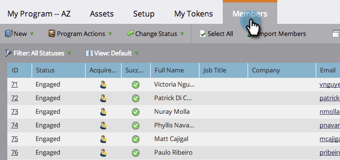
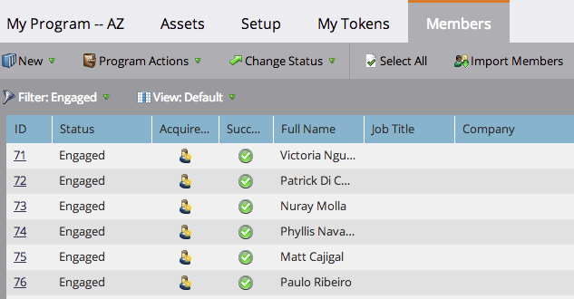

# Importera medlemmar från ett kalkylblad till ett program {#import-members-from-a-spreadsheet-into-a-program}

Du kan importera en lista över personer som automatiskt blir medlemmar i ett program. Så här gör du.

## Förbered din CSV-fil {#prepare-your-csv-file}

1. Skapa en CSV-standardfil i Excel, som i exemplet nedan.

   

   >[!CAUTION]
   >
   >Använd följande format när du importerar ett datum till ett datumfält: 13/9 23 (månad/dag/år).

## Importera din CSV-fil till Marketo {#import-your-csv-into-marketo}

1. Gå till **medlemssektionen** i ditt program.

   

1. Klicka på **Importera medlemmar**.

   

1. Markera CSV-filen och klicka på **Nästa**.

   

1. Mappa datavärdena från listan till motsvarande Markto-fält och klicka på **Nästa**.

   

   >[!NOTE]
   >
   >Om det finns fält som du inte vill importera väljer du **IGNORERA** i listrutan Marketinfält.

1. Välj **medlemsstatus** för listan.

   

1. Klicka på **Importera**.

   

1. Vänta tills Marketo är klar med importen och stäng sedan bekräftelsedialogrutan.

   

   Bra! Du bör se de nya medlemmarna som du importerade.

   

>[!NOTE]
>
>**Relaterade artiklar**
>
>* [Hantera och visa medlemmar](manage-and-view-members.md)

>

