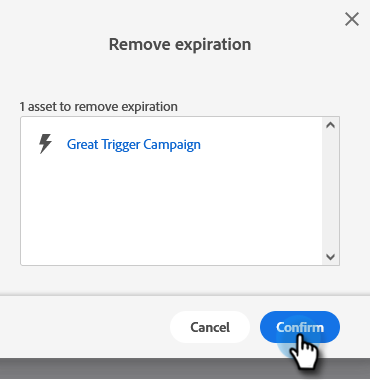

# Förfallotid för lokal resurs {#local-asset-expiration}

Ange ett förfallodatum/tid för att avpublicera landningssidor, inaktivera utlösarkampanjer eller stoppa återkommande batchkampanjer.

## Bevilja förfallotillstånd för planerad tillgång {#grant-schedule-asset-expiration-permission}

Innan du kan schemalägga förfallodatum för en mediefil måste din Marketo-roll ha rätt behörighet aktiverad.

>[!NOTE]
>
>**Administratörsbehörigheter krävs**

1. I [!UICONTROL Admin] område, klicka **[!UICONTROL Users & Roles]**.

   

1. Klicka på **[!UICONTROL Roles]** väljer du den användare som du vill ge åtkomst till och klickar sedan på **[!UICONTROL Edit Role]**.

   

1. Under [!UICONTROL Access Marketing Activities], markera **[!UICONTROL Schedule Local Asset Expiration]** och klicka **[!UICONTROL Save]**.

   

## Ange ett förfallodatum {#set-an-expiration-date}

1. Högerklicka på önskat program och välj **[!UICONTROL Set Local Asset Expiration]**.

   

1. Markera de mediefiler du vill ange ett förfallodatum för och klicka sedan på **[!UICONTROL Set Expiration]**.

   

1. Välj ett förfallodatum.

   

1. Ställ in en tid. Du måste schemalägga en tid på minst 20 minuter i framtiden (glöm inte att ange AM/PM). Klicka **[!UICONTROL Confirm]** när det är klart.

   

>[!NOTE]
>
>* Om du vill redigera ett befintligt förfallodatum kontrollerar du bara tillgångarna och klickar på **[!UICONTROL Set Expiration]**.
>* När en resurs har gått ut visas den inte längre i rutnätet Förfallodatum. Rutnätet visar bara publicerade landningssidor, aktiva utlösarkampanjer och återkommande batchkampanjer.
>* Schemalagda förfallodatum tas bort om resursen flyttas till ett annat program.

## Ta bort ett förfallodatum {#remove-an-expiration-date}

1. Om du vill ta bort ett förfallodatum kontrollerar du tillgången/tillgångarna och klickar på **[!UICONTROL Remove Expiration]**.

   

1. Granska de resurser som påverkas och klicka sedan på **[!UICONTROL Confirm]**.

   

>[!NOTE]
>
>Det går inte att ta bort förfallodatum som är mindre än 15 minuter framåt. Om du vill ta bort förfallodatumet måste du vänta tills resursen har gått ut och sedan godkänna eller aktivera den igen.
