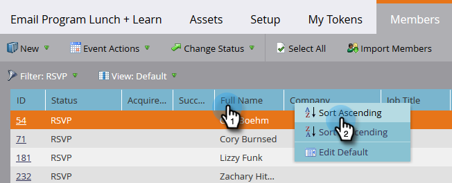

# Hantera och visa medlemmar {#manage-and-view-members}

Du kan hantera och visa dina medlemmar i dina program på fliken Medlemmar.

>[!NOTE]
>
>**FYI**
>
>Marketo standardiserar nu språk för alla prenumerationer, så du kan se lead/leads i din prenumeration och person/personer på docs.marketo.com. Dessa termer betyder samma sak. det påverkar inte artikelinstruktionerna. Det finns andra förändringar också. [Läs mer](http://docs.marketo.com/display/DOCS/Updates+to+Marketo+Terminology).

>[!NOTE]
>
>**Djupdykning**
>
> Gå ett steg längre i [programmedlemskapet](../../../../product-docs/core-marketo-concepts/programs/creating-programs/understanding-program-membership.md).

## Sök efter en medlem {#search-for-a-member}

Längst ned i avsnittet Medlemmar använder du sökfältet för att söka efter programmedlemmar efter namn, e-postadress, befattning eller företag.

1. Klicka på fliken **Medlemmar** i programmet.

   

1. Använd sökfältet för att söka i listan med medlemmar.

   

## Exportera stödrastret för medlemmar {#export-the-members-grid}

Du kan exportera din medlemslista genom att klicka på Excel-ikonen bredvid sökfältet.

## Hantera kolumner i medlemsrutnätet {#manage-columns-in-the-members-grid}

* Dra och släpp kolumner för att ändra deras ordning. De blå pilarna anger vart kolumnen ska placeras.

   

* Högerklicka på kolumnrubriken om du vill sortera i bokstavsordning, antingen stigande eller fallande.

   

## Välj vilka kolumner som ska visas i rutnätet {#choose-which-columns-are-visible-in-the-grid}

1. Klicka på listrutan **Visa **och välj **Skapa vy**.

   

1. Namnge din anpassade vy. Välj kolumnrubriker. Klicka på** Lägg till **och** ta bort **för att flytta kolumner och skapa en vy.

   

1. Klicka på **Skapa**.

   

## Filtrera medlemsstödrastret  {#filter-the-members-grid}

1. Klicka på listrutan **Filter** och välj ett förloppssteg att sortera efter.

   

## Hantera personstatus i medlemsrutnätet {#manage-person-status-in-the-members-grid}

Du kan ändra status för dina personer inuti medlemsrutnätet.

1. Håll ned **Ctrl/Cmd** och markera personerna.

   

1. Klicka på listrutan **Ändra status** och välj en status.

   

   Det här kan ta en stund. Du ser meddelandet nedan när allt är klart!

   

Många funktioner, men de är ganska enkla. Mycket nöje!

>[!NOTE]
>
>**Relaterade artiklar**
>
>* [Skapa en rapport om programprestanda](../../../../product-docs/core-marketo-concepts/programs/program-performance-report/create-a-program-performance-report.md)

>

