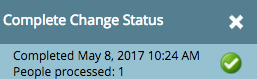

# Hantera och visa medlemmar {#manage-and-view-members}

Du kan hantera och visa dina medlemmar i dina program på fliken Medlemmar.

>[!NOTE]
>
>Gör mer i [programmedlemskapet](/help/marketo/product-docs/core-marketo-concepts/programs/creating-programs/understanding-program-membership.md).

## Sök efter en medlem {#search-for-a-member}

Längst ned i avsnittet Medlemmar använder du sökfältet för att söka efter programmedlemmar efter namn, e-postadress, befattning eller företag.

1. Klicka på fliken **Medlemmar** i ditt program.

   

1. Använd sökfältet för att söka i listan med medlemmar.

   

## Exportera rutnätet för medlemmar {#export-the-members-grid}

Du kan exportera din medlemslista genom att klicka på Excel-ikonen bredvid sökfältet.

## Hantera kolumner i medlemsstödrastret {#manage-columns-in-the-members-grid}

Dra och släpp kolumner för att ändra deras ordning. De blå pilarna anger vart kolumnen ska placeras.

Högerklicka på kolumnrubriken om du vill sortera i bokstavsordning, antingen stigande eller fallande.

## Välj vilka kolumner som ska visas i stödrastret {#choose-which-columns-are-visible-in-the-grid}

1. Klicka på listrutan **Visa** och välj **Skapa vy**.

   

1. Namnge din anpassade vy. Välj kolumnrubriker. Klicka på **Lägg till** och **Ta bort** för att flytta kolumner och skapa en vy.

   

1. Klicka på **Skapa**.

   

## Filtrera medlemsstödrastret {#filter-the-members-grid}

1. Klicka på listrutan **Filter** och välj ett förloppssteg att sortera efter.

   

## Hantera personstatus i medlemsstödrastret {#manage-person-status-in-the-members-grid}

Du kan ändra status för dina personer inuti medlemsrutnätet.

1. Håll ned **Ctrl/Cmd** och markera personerna.

   

1. Klicka på listrutan **Ändra status** och välj en status.

   

   Det här kan ta en stund. Du ser meddelandet nedan när allt är klart!

   

Många funktioner, men de är ganska enkla. Mycket nöje!

>[!MORELIKETHIS]
>
>[Skapa en rapport om programprestanda](/help/marketo/product-docs/core-marketo-concepts/programs/program-performance-report/create-a-program-performance-report.md)
