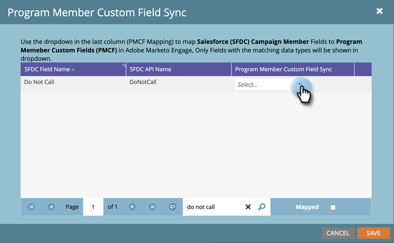

# Synkronisering av anpassat fält för programmedlem {#program-member-custom-field-sync}

>[!PREREQUISITES]
>
>* Skapande av [Anpassade fält för programmedlem](/help/marketo/product-docs/core-marketo-concepts/programs/working-with-programs/program-member-custom-fields.md){target=&quot;_blank&quot;}
>* [Synkronisera en Salesforce-kampanj med ett program](/help/marketo/product-docs/core-marketo-concepts/programs/working-with-programs/sync-an-sfdc-campaign-with-a-program.md){target=&quot;_blank&quot;}

>[!NOTE]
>
>Objektet Program Member kan ha upp till 20 anpassade fält. Dessa fält är tillgängliga för alla program.

## Mappa Salesforce-fält till anpassade programmedlemsfält {#map-salesforce-fields-to-program-member-custom-fields}

1. I Marketo klickar du på **Administratör**.

   

1. Klicka **Salesforce** och sedan klicka **Redigera** bredvid Synkronisering av anpassade fält för programmedlem.

   

1. Använd sökrutan för att hitta de Salesforce-fält som du vill mappa. I det här exemplet använder vi Do Not Call.

   

1. Klicka på listrutan.

   

1. Välj önskat anpassat fält för Marketo-programmedlem som ska mappas.

   

   >[!NOTE]
   >
   >I listrutan visas endast anpassade fält för programmedlemmar som matchar datatypen för Salesforce-fältet.

1. Om du vill ha ytterligare fältkopplingar avmarkerar du sökrutan och upprepar steg 3 till 5.

1. Klicka **Spara** när det är klart.

   

   >[!IMPORTANT]
   >
   >Ändringar av programmedlemsdata i mappade fält synkroniseras mellan Marketo och Salesforce framåt.

   >[!NOTE]
   >
   >Om du byter namn på eller ändrar datatypen för ett fält i Salesforce tar vi bort alla mappningar av det fältet med det anpassade fältet för programmedlem. Men du kan mappa om det med det nya fältet efter granskning.

## Ta bort mappning av Salesforce-fält från anpassade programmedlemsfält {#unmap-salesforce-fields-from-program-member-custom-fields}

Om du vill frigöra ett fält för att ersätta det, eller bara göra en allmän ändring, måste du först ta bort mappningen. Så här gör du.

1. I Marketo klickar du på **Administratör**.

   

1. Klicka **Salesforce** och sedan klicka **Redigera** bredvid Synkronisering av anpassade fält för programmedlem.

   

1. Använd sökrutan för att hitta de fält som du vill ta bort mappningen för. I det här exemplet använder vi Do Not Call.

   

   >[!TIP]
   >
   >Du kan välja **Mappat** om du bara vill visa mappade fält.

1. Dela upp genom att klicka på **X** bredvid fältet.

   

1. Mappningen har tagits bort. Klicka **Spara**.

   

## Datatypsmappning {#data-type-mapping}

<table>
  <colgroup>
    <col/>
    <col/>
  </colgroup>
  <tbody>
    <tr>
      <th>SFDC-datatyp</th>
      <th>Datatyp för anpassat fält för programmedlem</th>
    </tr>
    <tr>
      <td>Text</td>
      <td>Sträng</td>
    </tr>
    <tr>
      <td>Picklist</td>
      <td>Sträng</td>
    </tr>
    <tr>
      <td>Flervalslista</td>
      <td>Sträng</td>
    </tr>
    <tr>
      <td>Tel.</td>
      <td>Sträng</td>
    </tr>
    <tr>
      <td>E-post</td>
      <td>Sträng</td>
    </tr>
    <tr>
      <td>Antal (m)</td>
      <td>Heltal</td>
    </tr>
    <tr>
      <td>Number(m,n)</td>
      <td>Float</td>
    </tr>
    <tr>
      <td>Kryssruta</td>
      <td>Boolean</td>
    </tr>
    <tr>
      <td>URL</td>
      <td>URL</td>
    </tr>
    <tr>
      <td>Datum</td>
      <td>Datum</td>
    </tr>
    <tr>
      <td>Datetime</td>
      <td>Datetime</td>
    </tr>
    <tr>
      <td>Uppslag (referens)</td>
      <td>Sträng</td>
    </tr>
    <tr>
      <td>Base64</td>
      <td>Sträng</td>
    </tr>
  </tbody>
</table>

>[!MORELIKETHIS]
>
>* [Ändra medlemsuppgifter för program](/help/marketo/product-docs/core-marketo-concepts/smart-campaigns/program-flow-actions/change-program-member-data.md){target=&quot;_blank&quot;}
>* [Visa data i programmedlemsrutnätet](/help/marketo/product-docs/core-marketo-concepts/programs/working-with-programs/manage-and-view-members.md){target=&quot;_blank&quot;}
>* [SFDC-synkronisering - kampanjsynkronisering](/help/marketo/product-docs/crm-sync/salesforce-sync/sfdc-sync-details/sfdc-sync-campaign-sync.md){target=&quot;_blank&quot;}

