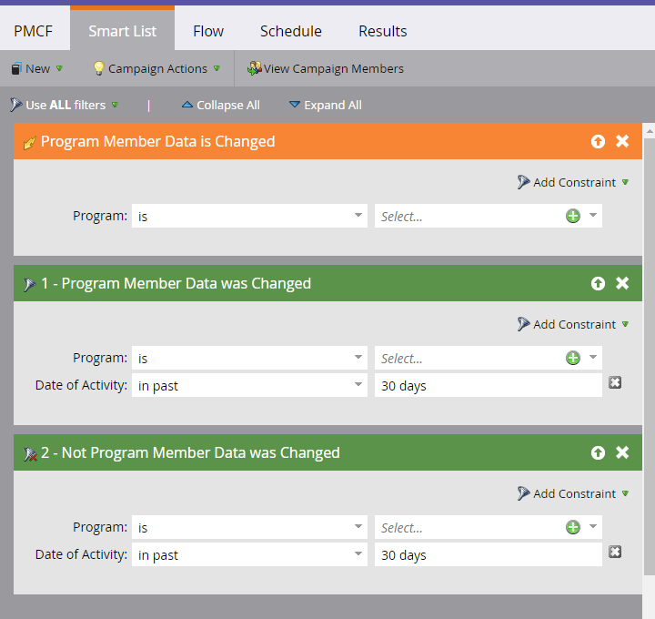

# Anpassade fält för programmedlem {#program-member-custom-fields}

Med anpassade fält för programmedlemmar kan du samla in programspecifika data för varje medlem. De kan användas i: Marketo-formulär, Smart List-filter och -utlösare samt åtgärder för Smart Campaign-flödet. Data kan visas på fliken Medlemmar i programmet.

## Skapa ett anpassat fält för programmedlem {#create-a-program-member-custom-field}

1. I Marketo klickar du på **Admin**.

   

1. Klicka på **Fälthantering**.

   

1. Klicka på **Nytt anpassat fält**.

   

1. Klicka på listrutan Objekt och markera önskat objekt.

   

   >[!NOTE]
   >
   >Anpassade fält för person och programmedlem kan inte ha samma namn.

1. Fyll i de återstående fälten och klicka på **Skapa**.

   

   >[!NOTE]
   >
   >Typer som stöds för anpassade fält för programmedlemmar är: boolesk, date, datetime, float, integer, string, URL. [Läs mer om fälttyper](http://docs.marketo.com/x/Wwgt).

## Objektbeskrivningar {#object-descriptions}

| Objekt | Beskrivning |
|---|---|
| Företag | Namnet på det företag som är associerat med personen. |
| Möjligheter | En affärsmöjlighet kan kopplas till en person eller ett konto som en potentiell framtida försäljning. De går vanligtvis in på Marketo via en CRM eller via API. |
| Person | En individ i er Marketo-databas som ni engagerar med hjälp av marknadsföringskampanjer. |
| Programmedlem | Person som även är medlem i ett program |

## Utlösare och filter {#triggers-and-filters}

Du kan använda dessa programspecifika data i smarta listor via [utlösare](http://docs.marketo.com/x/PoAR)och/eller [filter](http://docs.marketo.com/x/2YAI).

## Saker att känna till {#things-to-know}

* Anpassade fält för programmedlemmar är endast tillgängliga i lokala resurser. De stöds inte i Design Studio eftersom det inte finns något sätt att knyta dem till ett specifikt program.
* Du kan inte klona/flytta ett formulär (eller en landningssida med ett formulär) som innehåller anpassade fält för programmedlem till Design Studio.
* Anpassade fält för programmedlem kan inte användas som token.
* Objektet Program Member kan ha upp till 20 anpassade fält. Dessa fält är tillgängliga för alla program.
* När du tar bort en medlem i ett program och har data i det anpassade fältet Programmedlem, rensas data från det fältet.
* Om du vill visa data klickar du på fliken Medlemmar i programmet och skapar en anpassad vy som innehåller dessa fält.
* Import och export via [list](http://docs.marketo.com/x/egAk)och [API](http://developers.marketo.com/)stöds.
* När du sammanfogar två personer används vinnarens anpassade fältdata för programmedlemmen. Men om vinnaren inte har något värde kommer förlorarens värde att användas.

>[!MORELIKETHIS]
>
>[Skapa ett anpassat fält i Marketo](../../../../product-docs/administration/field-management/create-a-custom-field-in-marketo.md)

