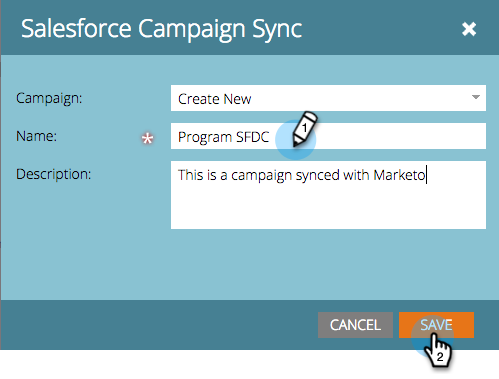

# Synkronisera en SFDC-kampanj med ett program {#sync-an-sfdc-campaign-with-a-program}

Med Marketo kan ni synkronisera era program med Salesforce-kampanjer för att behålla samma lista över personer i båda systemen, inklusive deras status. Kom så börjar vi!

>[!PREREQUISITES]
>
>Du måste [aktivera Salesforce-kampanjsynkronisering](/help/marketo/product-docs/crm-sync/salesforce-sync/setup/optional-steps/enable-disable-campaign-sync.md) först.

>[!CAUTION]
>
>När en SFDC-kampanj synkroniseras med ett Marketo-program inaktiveras de underliggande SFDC-åtgärderna (t.ex. lägg till i SFDC Campaign, Synkronisera till SFDC) för programmets underordnade kampanjer.

1. Gå till **Marknadsföringsaktiviteter**.

   

1. Välj program.

   

1. Klicka **Programåtgärder** väljer **Salesforce Campaign-synkronisering**.

   

1. Välj **Skapa nytt** eller välj en befintlig Salesforce-kampanj.

   >[!TIP]
   >
   >Om du väljer en befintlig Salesforce-kampanj ska du se till att [matchar programstatusvärdena för Salesforce-kampanjen och Marketo-programmet](/help/marketo/product-docs/crm-sync/salesforce-sync/sfdc-sync-details/how-to-match-program-statuses-and-salesforce-campaign-statuses-prior-to-sync.md).

1. Ange ett namn för den nya kampanjen och klicka på **Spara**.

   

1. Nu kan du verifiera kampanjsynkroniseringsinformationen på programsammanfattningssidan.

   

   Underbar! Nu synkroniseras alla programstatusändringar i Marketo till SFDC-kampanjen och vice versa.
