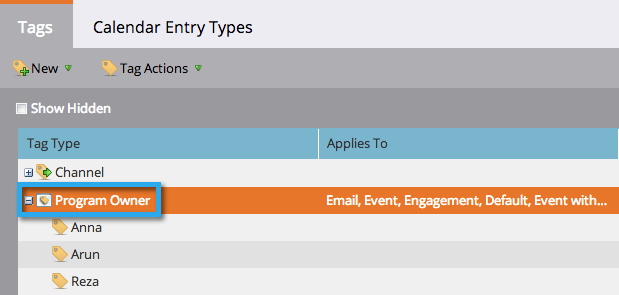
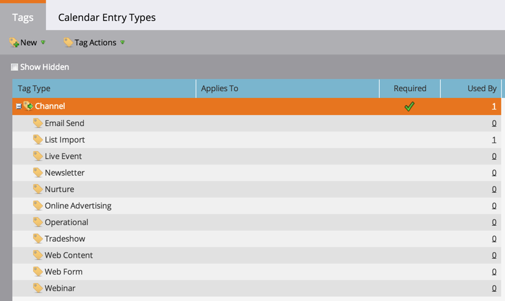

# Taggar {#understanding-tags}

Nu vet ni säkert att program är som byggstenar i Marketo. Genom att använda taggar och kanaler blir det lättare att filtrera data för rapportering.

Taggar används för att beskriva program. Ni kan skapa så många ni behöver, var och en med unika värden. Kanaler identifierar leveransmekanismen i ett program, som webbinarium, sponsring eller online-annonsering.

## Taggtyp {#tag-type}

Märkordstyper identifierar den typ av information som du vill sortera efter.

>[!TIP]
>
>Kontakta din [Marketo Admin](http://docs.marketo.com/display/DOCS/Create+Custom+Tags) om du vill skapa egna taggar.

>[!NOTE]
>
>**Exempel**
>
>* Tagg Type = Program Owner

>

## Taggvärde {#tag-value}

Varje taggtyp har värden att välja mellan.

>[!NOTE]
>
>**Exempel**
>
>* Taggvärden = Anna, Arun, Reza

>

## Kanal {#channel}

Kanaler används för att rapportera hur [medlemmarna](../../../../product-docs/core-marketo-concepts/programs/creating-programs/understanding-program-membership.md) har gått igenom programmet. Varje kanal har en uppsättning status för progression och en status som är inställd på samma framgång.

>[!NOTE]
>
>**Exempel**
>
>* Kanal = Roadshow
   >
   >
* Progressionsstatus = Inbjuden, Registrerad, Bifogad, Ingen visning
>* Lyckades = Bifogad

>

>[!MORELIKETHIS]
>
>* [Skapa egna taggar](../../../../product-docs/administration/tags/create-custom-tags.md)
>* [Skapa en programkanal](../../../../product-docs/administration/tags/create-a-program-channel.md)

>

