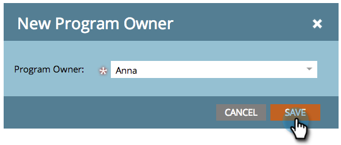

# Använd taggar i ett program {#use-tags-in-a-program}

Taggar är attribut som beskriver dina program och används för att gruppera programtyper vid rapportering.

>[!NOTE]
>
>Om du använder Inkomstcykel Explorer måste en periodkostnad definieras (även om det är 0) för att rapporteringen ska vara tillgänglig för programmet.

## Använda en tagg i ett program {#use-a-tag-in-a-program}

1. Välj program. Klicka på **Konfigurera**.

   

1. Dra en tagg till arbetsytan.

   

1. Välj ett värde i listrutan.

   

1. Klicka på **Spara**.

   

1. Just nu. Den nya taggen visas på arbetsytan.

   

## Redigera en tagg {#edit-a-tag}

1. Gå till fliken **Inställningar**. Högerklicka på taggen. Välj **Redigera**.

   

1. Klicka på listrutan. Välj ett nytt värde.

   

1. Klicka på **Spara**.

   

1. Bra! Redigeringarna visas på arbetsytan.

   

## Ta bort en tagg  {#delete-a-tag}

1. Gå till fliken **Inställningar**. Högerklicka på taggen och välj **Ta bort**.

   

1. Bekräfta genom att klicka på **Ta bort**.

   

Snyggt jobbat! Program med konsekventa taggar gör det enklare att köra rapporter.
