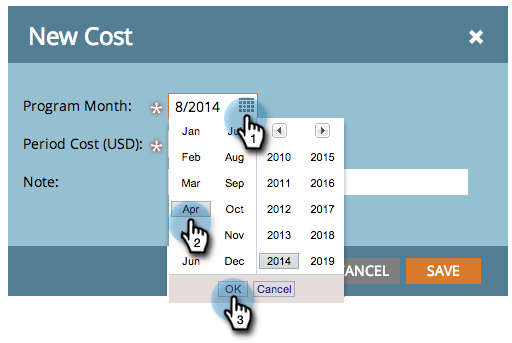

# Använda periodkostnader i ett program {#using-period-costs-in-a-program}

En [periodkostnad](understanding-period-costs.md) är det belopp du spenderar på ett program. Den kan vara i en eller flera månader och används för att rapportera ROI.

>[!NOTE]
>
>**Djupdykning**
>
> Läs mer om [Revenue Cycle Analytics](http://docs.marketo.com/display/docs/revenue+cycle+analytics).

## Lägg till en periodkostnad  {#add-a-period-cost}

1. Gå till fliken **Inställningar** i programmet.

   

1. Dra och släpp **Periodkostnad** på arbetsytan.

   

1. Klicka på kalenderikonen. Välj en månad. Klicka på **OK**.

   

1. Ange en **periodkostnad** (utan decimaler eller kommatecken). Klicka på **Spara**.

   >[!NOTE]
   >
   >Detta kan vara en uppskattning. Du kan alltid redigera en periodkostnad när du vet det exakta beloppet (se nästa avsnitt).

   

1. Kostnaden visas i programmet.

   

   >[!TIP]
   >
   >Du kan dra och släppa flera periodkostnader på arbetsytan. På så sätt kan du tilldela programmet flera månader med olika periodkostnader.

## Redigera en periodkostnad {#edit-a-period-cost}

1. Om du spenderar mer eller mindre pengar än vad som ursprungligen planerats kan du redigera periodkostnaden.
1. Gå till fliken **Setup **i programmet.

   

1. Högerklicka på **Periodkostnad**. Välj **Redigera**.

   

1. Redigera. Klicka på **Spara**.

   

## Ta bort en periodkostnad {#delete-a-period-cost}

1. Gå till fliken **Inställningar** i programmet.

   

1. Högerklicka på **Periodkostnad**. Välj **Ta bort**.

   

1. Bekräfta genom att klicka på **Ta bort **.

   

>[!MORELIKETHIS]
>
>* [Förstå periodkostnader](understanding-period-costs.md)
>* [Analys av intäktscykler](http://docs.marketo.com/display/docs/revenue+cycle+analytics)
>* [Filtrera en programrapport efter periodkostnad](../../../../product-docs/core-marketo-concepts/programs/program-performance-report/filter-a-program-report-by-period-cost.md)

>

