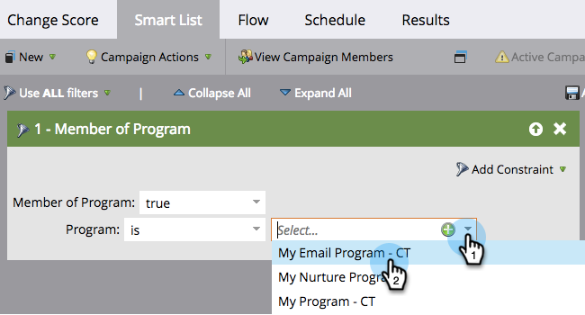

# Definiera smart lista för smart kampanj | Grupp {#define-smart-list-for-smart-campaign-batch}

Smarta listor är en mekanism i hela Marketo som definierar&quot;vem&quot; (vilka personer) som ska inkluderas, oavsett om det är en rapport, en lista eller en Smart Campaign. Så här definierar du en smart lista för en batchkampanj.

1. Välj en smart kampanj och klicka sedan på **Smart List**.

   

1. Skriv om du vill söka efter ett filter och dra det till arbetsytan. Upprepa för flera filter.

   

   >[!NOTE]
   >
   >En smart kampanj med bara filter körs i **Grupp** läge. Den hittar personer i databasen som är kvalificerade baserat på filtren och kör alla via flödet samtidigt.

   >[!NOTE]
   >
   >Du kan få en smart kampanj att köras på en person i taget baserat på live-händelser genom att lägga till utlösare, vilket gör att den smarta kampanjen **Utlösare** läge.

1. Klicka på listrutan och välj en filteroperator för det filter du valt.

   

   >[!CAUTION]
   >
   >Rödaktiga linjer indikerar fel eller att information saknas. Om den inte korrigeras blir kampanjen ogiltig och körs inte.

1. Ange filtervärdet.

   

   >[!NOTE]
   >
   >Som standard är personer som uppfyller alla smarta listregler kvalificerade. Detta kan ändras för att passa era kampanjbehov. Checka ut  [Smart List-regler för komplex logik](/help/marketo/product-docs/core-marketo-concepts/smart-lists-and-static-lists/using-smart-lists/using-advanced-smart-list-rule-logic.md) om du vill veta mer.

   Lär dig hur du aktiverar live-händelser för en person i taget [Definiera smart lista för smart kampanj | Utlösare](/help/marketo/product-docs/core-marketo-concepts/smart-campaigns/creating-a-smart-campaign/define-smart-list-for-smart-campaign-trigger.md).

   >[!MORELIKETHIS]
   >
   >* [Definiera smart lista för smart kampanj | Utlösare](/help/marketo/product-docs/core-marketo-concepts/smart-campaigns/creating-a-smart-campaign/define-smart-list-for-smart-campaign-trigger.md)
   >* [Lägg till ett flödessteg i en smart kampanj](/help/marketo/product-docs/core-marketo-concepts/smart-campaigns/flow-actions/add-a-flow-step-to-a-smart-campaign.md)
