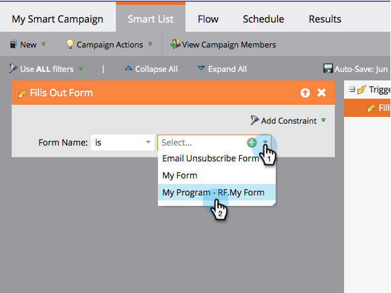

# Definiera smart lista för smart kampanj | Utlösare {#define-smart-list-for-smart-campaign-trigger}

Få en smart kampanj att köras på en person i taget baserat på live-händelser genom att lägga till utlösare.

1. Klicka på fliken **Smart List **i den smarta kampanjen.

   

1. Sök efter utlösaren och dra och släpp sedan utlösaren på arbetsytan.

   

   >[!NOTE]
   >
   >En smart kampanj med utlösare körs i **utlösarläge**. Den körs på en person i taget baserat på händelser som utlösts och eventuella ytterligare filter.

1. Klicka på listrutan och välj en operator.

   

   >[!CAUTION]
   >
   >Rödaktiga linjer indikerar fel eller att information saknas. Om den inte korrigeras blir kampanjen ogiltig och körs inte.

   >[!TIP]
   >
   >I en smart kampanj med både utlösare och filter ligger utlösarna överst och när de aktiveras går bara personer som uppfyller filtervillkoren igenom flödet.

1. Definiera utlösaren.

   

   >[!NOTE]
   >
   >Med flera utlösare går en person igenom flödet om **ANY** någon av utlösarna aktiveras.

   [Definiera smart lista för smart kampanj | Grupp](define-smart-list-for-smart-campaign-batch.md)

   >[!NOTE]
   >
   >**Relaterade artiklar**
   >
   >    
   >    
   >    * [Definiera smart lista för smart kampanj | Grupp](define-smart-list-for-smart-campaign-batch.md)
   >    * [Lägg till ett flödessteg i en smart kampanj](../../../../product-docs/core-marketo-concepts/smart-campaigns/flow-actions/add-a-flow-step-to-a-smart-campaign.md)

Om du vill köra kampanjen på en uppsättning personer samtidigt ska du lära dig hur du gör .