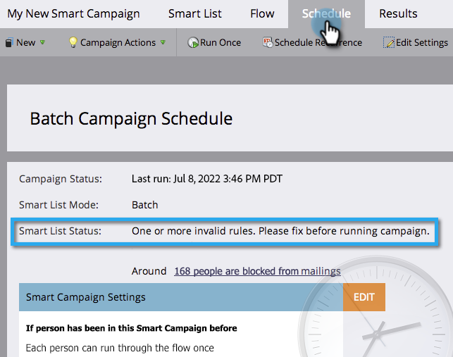

# Kontrolllista för smart kampanj {#smart-campaign-checklist}

Följ stegen nedan för att se till att den smarta kampanjen körs på ett smidigt sätt och för att förhindra så många fel som möjligt.

## Ta bort fel i smarta listor {#get-rid-of-smart-list-errors}

Klicka på **[!UICONTROL Smart List]** i din smarta kampanj. Ta bort röda, blanka linjer som du ser genom att åtgärda felen.

>[!TIP]
>
>Rödaktiga linjer indikerar fel eller att information saknas. Om den inte korrigeras blir kampanjen ogiltig och körs inte.
>
>Du kan också göra det enkelt. Om du har dussintals eller hundratals filter är det svårt att behålla dem och hålla reda på dem. Det går också snabbare att läsa in färre filter.

>[!NOTE]
>
>Om du använder **[!UICONTROL Member of Smart List]** kan det finnas fel i den andra listan. Kolla där också.

## Hämta RID för flödesfel {#get-rid-of-flow-errors}

Klicka på **[!UICONTROL Flow]** i din smarta kampanj. Ta bort röda, blanka linjer genom att åtgärda felen.

>[!TIP]
>
>Håll muspekaren över den röda, sneda linjen för att se detaljer om felet.

## Granska fliken Schema {#review-the-schedule-tab}

På fliken **[!UICONTROL Schedule]** kontrollerar du om det finns fel i den smarta kampanjen som behöver åtgärdas i **[!UICONTROL Smart List Status]**.

## Gräns för begränsning av personbegränsningar {#check-person-restrictions-limit}

På fliken **[!UICONTROL Schedule]** kontrollerar du att antalet kvalificerade personer inte överstiger personbegränsningen.

>[!TIP]
>
>Om det behövs kan du [åsidosätta personbegränsningar i en smart kampanj](/help/marketo/product-docs/core-marketo-concepts/smart-campaigns/using-smart-campaigns/override-person-restrictions-in-a-smart-campaign.md).

>[!NOTE]
>
>**Påminnelse**
>
>Om din smarta kampanj fortfarande inte fungerar kan du lära dig hur du [förstår meddelanden](/help/marketo/product-docs/core-marketo-concepts/miscellaneous/understanding-notifications.md) för att ta reda på vad som gick fel och hur du åtgärdar det.

Snyggt jobb! Ha checklistan till hands innan du kör en smart kampanj.
