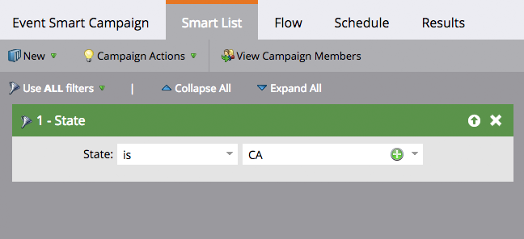
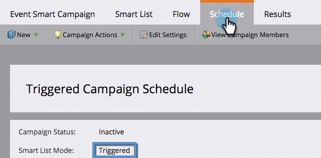

# Förstå smarta gruppkampanjer och utlösare {#understanding-batch-and-trigger-smart-campaigns}

Det finns två typer av smarta kampanjer: Batch och utlösare.

## Batch Smart Campaign {#batch-smart-campaign}

>[!NOTE]
>
>**Definition**
>
>En batchkampanj startas vid en viss tidpunkt och påverkar en viss uppsättning personer på en gång. Ett exempel är att skicka ett e-postmeddelande till alla i Kalifornien.

Smarta gruppkampanjer har bara filter i avsnittet med smarta listor (d.v.s. inga utlösare).

Om du klickar på fliken **Schedule** bekräftar du att den smarta kampanjen är inställd på &quot;Batch&quot;.

**Smarta gruppkampanjer**

* Kan schemaläggas för återkommande aktiviteter, som dagliga, veckovisa och månadsvisa. Du kan också få dem att springa bara en gång.
* Är synliga i [programschemavyn](/help/marketo/product-docs/core-marketo-concepts/programs/program-schedule-view/navigating-the-program-schedule-view.md). Allt efter ett &quot;Vänta&quot;-steg i den smarta kampanjen inkluderas inte i vyn.

  

## Utlös smart kampanj {#trigger-smart-campaign}

>[!NOTE]
>
>**Definition**
>
>En utlösande smart kampanj påverkar en person i taget baserat på en utlöst händelse. Ett exempel på en utlösare är att klicka på en länk i ett e-postmeddelande.

Om en smart kampanj använder minst en utlösare i den smarta listsektionen ställs läget automatiskt in på utlösare.

Om du klickar på fliken **Schedule** bekräftar du att den smarta kampanjen är inställd på Triggered.

**Utlös smarta kampanjer**

* Det går inte att schemalägga för återkommande aktiviteter. De kan bara anges som aktiva eller inaktiva.
* Du kan ställa in mer än en utlösare. Om någon utlösare aktiveras körs kampanjåtgärderna.

>[!TIP]
>
>Använd [aktivitetsloggen](/help/marketo/product-docs/core-marketo-concepts/smart-lists-and-static-lists/managing-people-in-smart-lists/locate-the-activity-log-for-a-person.md) för att se vad som hände steg för steg inom smarta kampanjer. Du hittar aktivitetsloggen på den sista fliken på en persons detaljsida.
