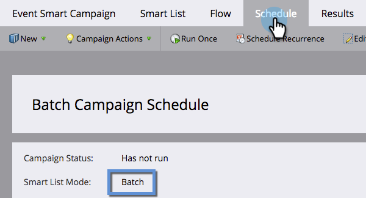

# Förstå smarta kampanjer i grupp och utlösare {#understanding-batch-and-trigger-smart-campaigns}

Det finns två typer av smarta kampanjer: Batch och Trigger.

## Gruppkampanj {#batch-campaign}

>[!NOTE]
>
>**Definition**
>
>En batchkampanj startar vid en viss tidpunkt och påverkar en viss uppsättning personer på en gång. Ett exempel är att skicka ett mejl till alla i Kalifornien.

Batchkampanjer har bara filter i det smarta listavsnittet (dvs. inga utlösare).

Klicka på **Schema** -fliken bekräftar att den smarta kampanjen är inställd på&quot;Gruppera&quot;.

**Batchsmarta kampanjer**

* Kan schemaläggas för återkommande aktiviteter, som dagliga, veckovisa och månadsvisa. Du kan också få dem att springa bara en gång.
* Är synliga på [programschemavy](/help/marketo/product-docs/core-marketo-concepts/programs/program-schedule-view/navigating-the-program-schedule-view.md). Allt efter ett &quot;Vänta&quot;-steg i den smarta kampanjen inkluderas inte i vyn.

  

## Utlös kampanj {#trigger-campaign}

>[!NOTE]
>
>**Definition**
>
>En utlösarkampanj påverkar en person i taget baserat på en utlöst händelse. Ett exempel på en utlösare är att klicka på en länk i ett e-postmeddelande.

Om en smart kampanj använder minst en utlösare i avsnittet Smart lista ställs läget automatiskt in på utlösare.

Klicka på **Schema** -fliken bekräftar att den smarta kampanjen är inställd på&quot;Triggered&quot;.

**Utlösarkampanjer**

* Det går inte att schemalägga för återkommande aktiviteter. De kan bara anges som aktiva eller inaktiva.
* Du kan ställa in mer än en utlösare. Om någon utlösare utlöses körs kampanjåtgärderna.

>[!TIP]
>
>Använd [aktivitetslogg](/help/marketo/product-docs/core-marketo-concepts/smart-lists-and-static-lists/managing-people-in-smart-lists/locate-the-activity-log-for-a-person.md) om du vill se vad som har hänt steg för steg i smarta kampanjer. Du hittar aktivitetsloggen på den sista fliken på en persons detaljsida.
