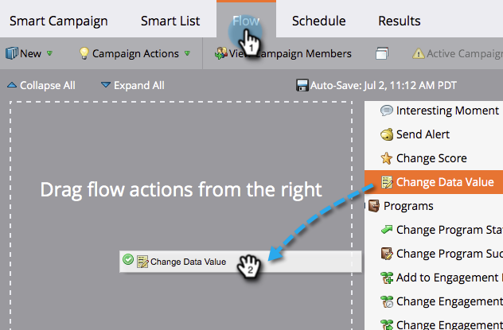

# Lägg till data i ett fält {#append-data-to-a-field}

Det finns ett enkelt sätt att lägga till data i ett fält. Så här gör du.

>[!PREREQUISITES]
>
>[Skapa en kampanj](/help/marketo/product-docs/core-marketo-concepts/smart-campaigns/creating-a-smart-campaign/create-a-new-smart-campaign.md)

1. Under fliken **Flöde** drar du i flödessteget **Ändra datavärde**.

   

1. Sök efter och markera det fält som du vill lägga till data i.

   

1. Sök efter och välj token för samma fält som du vill lägga till data i.

   

1. Lägg nu till värdet som du vill lägga till i det som redan finns i fältet.

   

Så ja! Där kan du hämta kreativa variabler och lägga till flera variabler.
