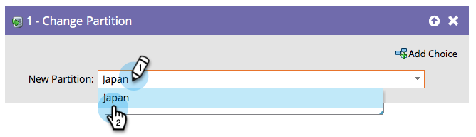

# Ändra personpartition {#change-person-partition}

Om du använder [arbetsytor och partitioner](/help/marketo/product-docs/administration/workspaces-and-person-partitions/understanding-workspaces-and-person-partitions.md){target="_blank"} vill du skapa smarta kampanjer som flyttar personer från en partition till en annan.

1. Markera den partition som du vill flytta dina personer till.

Så enkelt är det!
