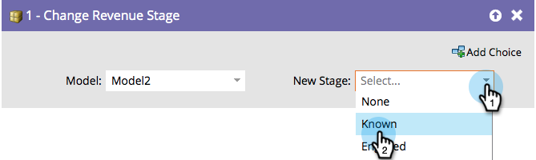

# Ändra intäktsfas {#change-revenue-stage}

Om du använder Inkomstcykel Modeler och har en godkänd modell kan du bestämma dig för att flytta personer manuellt från en fas till en annan. Det här flödessteget är till hjälp.

1. Välj **[!UICONTROL Model]**.

   

1. Markera **[!UICONTROL New Stage]** som du vill tilldela och du är klar!

   

   >[!CAUTION]
   >
   >Datalagret är noga med när personer rör sig mellan faser. Detta kan skapa felaktiga data om de används felaktigt.
