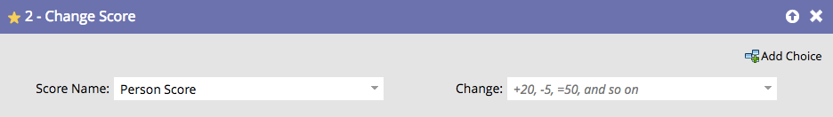

# Ändra poäng {#change-score}

Det är enkelt och kraftfullt att betygsätta människor och det hjälper säljteamet att prioritera.

1. Välj det poängfält som du vill ändra.

   

   >[!TIP]
   >
   >Du kan skapa flera poängfält. Mer information finns i [Skapa ett anpassat fält i Marketo](/help/marketo/product-docs/administration/field-management/create-a-custom-field-in-marketo.md){target="_blank"}.

1. Ange den poängändring du vill ha.

   

   Ändringar:

   * **+5** till ökning
   * **-5** minskar (negativa tal tillåts)
   * **=5** kommer att göra poängen med det exakta talet
   * **=-5** kommer att göra poängen exakt negativt tal

Få lite grundläggande poängsättning på plats snabbt och finjustera sedan resultatet över tid.
