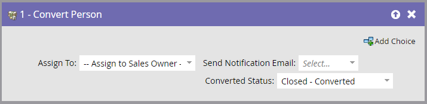

# Konvertera person {#convert-person}

Använd det här flödessteget om du vill konvertera en person till en kontakt i [!DNL Salesforce]. Du kan bestämma vem du ska tilldela kontakten till, skicka ett meddelande till ägaren och ange en konverterad status.

>[!NOTE]
>
>Detta är endast tillgängligt när det är integrerat med [!DNL Salesforce].

1. Välj vem du vill tilldela den resulterande kontakten, kontot och affärsmöjligheten till.

   

   >[!CAUTION]
   >
   >Om du konverterar en person i Marketo skapas ett nytt konto och en ny affärsmöjlighet i [!DNL Salesforce]. Om du inte vill ha dubblettkonton använder du [!DNL Salesforce] för att konvertera.

1. Välj om du vill att **[!UICONTROL notification]** ska skickas till ägaren eller inte.

   

1. Välj **[!UICONTROL converted status]**.

   
