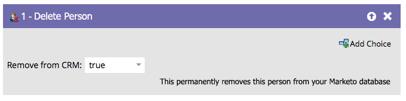

# Ta bort person {#delete-person}

Fel personer kommer ibland in i databasen. Flödessteget Ta bort person kan ta bort dem.

>[!CAUTION]
>
>När du tar bort en person tas även alla deras historiska RCE-data bort. Det kan inte ångras.

1. När du drar i flödessteget ställs det automatiskt in på att tas bort från CRM.

   

1. Du kan ta bort från Marketo Engage och inte från CRM, till exempel:

   

>[!NOTE]
>
>Det går bara att ta bort personen från CRM _med[!DNL Salesforce]_. Om du tar bort en person från Marketo och väljer att behålla den i [!DNL Salesforce], återskapas personen i Marketo om hans/hennes [!DNL Salesforce]-post någonsin uppdateras.
