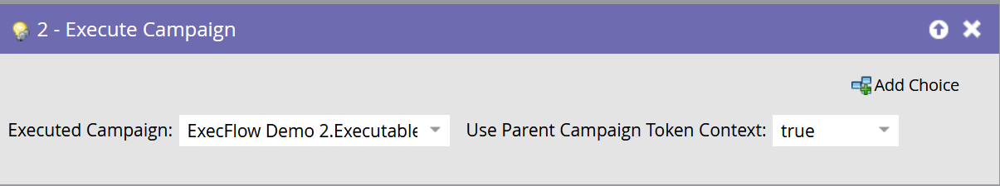

# Kör kampanj {#execute-campaign}

En körbar kampanj innehåller, precis som andra kampanjer, en smart lista, ett flöde och ett schema. Till skillnad från andra kampanjer schemalägger eller aktiverar ni dem egentligen inte. Den kan bara anropas av en annan kampanj via flödessteget Kör kampanj. Flödesstegen i den körbara kampanjen körs i serie med den överordnade kampanjen (till skillnad från Request Campaign, som körs parallellt i en separat utlösarkampanj).

>[!NOTE]
>
>Körbara kampanjer är alltid underordnade den (överordnade) kampanj som anropar dem.

## När ska Kör kampanj användas {#when-to-use-execute-campaign}

Det finns mycket du kan göra med en körbar kampanj. De är utformade för att underlätta vanliga operativa uppgifter, som leaddirigering, livscykelhantering och poängsättning (bland annat), och kan användas för att köra samma arbetsflöde inifrån Batch eller Triggered Campaigns.

Du kan också använda dem när du behöver köra ett separat flöde, men du måste vara beroende av resultatet av det flödet i efterföljande val av flödessteg (d.v.s. göra det).

Kör kampanj är en förbättring på [Begär kampanj](/help/marketo/product-docs/core-marketo-concepts/smart-campaigns/flow-actions/request-campaign.md), eftersom den kan köras i serie eller parallellt, medan den senare bara körs parallellt.

>[!NOTE]
>
>Wait Steps och Webhooks kommer aldrig att vara kompatibla med körbara kampanjer. Därför måste ni använda Request Campaign i stället.

## Så här skapar du en körbar kampanj {#how-to-create-an-executable-campaign}

1. Högerklicka på önskat program och välj **Ny smart kampanj**.

   

1. Ge den ett namn, markera kryssrutan **Körbar** och klicka på **Skapa**.

   

1. Definiera Smart List och Flow, precis som andra smarta kampanjer.

Du kan också klona en befintlig smart kampanj. Om du klonar en befintlig körbar kampanj måste du fortfarande markera kryssrutan **Körbar** när du har namngett den.

>[!NOTE]
>
>Du kan inte klona en kampanj som innehåller utlösare.

## Använd kontext för överordnad kampanjtoken {#use-parent-campaign-token-context}

Om värdet är true skickas följande tokenkontexter till den underordnade kampanjen (den som körs):

* Mina token
* Kampanjtoken
* Programtoken
* Medlemstoken
* [Utlösartoken](/help/marketo/product-docs/marketo-sales-insight/msi-for-salesforce/features/tabs-in-the-msi-panel/interesting-moments/trigger-tokens-for-interesting-moments.md)  (om de anropas från en utlöst kampanj)

**API-interaktion**

När du använder Schedule eller Request Campaign [i API](https://developers.marketo.com/rest-api/assets/smart-campaigns/#batch) kan du båda skicka värden för Mina token, som åsidosätter de värden som angetts för dessa token i kampanjen som du anropar. Om den kampanjen sedan kör en annan kampanj och anger &quot;Use Parent Context to True&quot;, används de värden som skickas via API:t i stället för de värden som anges i programmet.

## Saker att notera {#things-to-note}

* Smart List filtrerar bort alla som inte är kvalificerade. Om en person kvalificerar sig kommer den resulterande körda kampanjaktivitetsposten att visa dem som&quot;Kvalificerade: TRUE&quot; (och FALSE om de inte gör det)
* Schemalägg kampanjkvalificeringsregler gäller (inställningarna för smart kampanj under fliken Schema)
* Körbara kampanjer kan inte anropas mellan arbetsytor
* Om du använder flödesåtgärden [Ta bort från flöde](/help/marketo/product-docs/core-marketo-concepts/smart-campaigns/flow-actions/remove-from-flow.md) för en körbar kampanj kommer den att ha både det underordnade och det överordnade målet
* Utnyttja fördelarna med tokenarv - Om du till exempel har ett enda gemensamt poängflöde som aktiveras av flera olika resurser kan du definiera standardvärdet för Min token i den underordnade kampanjen och i den överordnade kampanjen så att du kan åsidosätta kampanjvärdet för det underordnade poängvärdet för dina överordnade kampanjer (se nedan som visuellt exempel)
* Körbara kampanjer kan anropas på upp till tre nivåer djupa (t.ex. Överordnad kampanj > Underordnad > Underordnad > Underordnad)

>[!CAUTION]
>
>Lämna aldrig dina smarta listor för körbara kampanjer ogiltiga, annars är ingen **berättigad**. Det bästa sättet är att skapa separata resurser för smarta listor, definiera dem helt och se till att de är giltiga. Använd sedan filtret&quot;Medlem i smart lista&quot; i den körbara kampanjen så att du kan byta ut din smarta listdefinition.

## Exempel på tokenarv {#token-inheritance-example}

Nedan visas ett visuellt exempel på tokenarv i en körbar kampanj och två överordnade kampanjer: ett med tokenkontext inställd på **True**, det andra på **Falskt**.

Underordnad kampanj med en tokeniserad Change Score.

Barnets kampanj är Mina token.

**Exempel ett - sant**

I steget Kör kampanjflöde i den första överordnade kampanjen anges &quot;Use Parent Campaign Token Context&quot; till **True**.

Den överordnade kampanjen är Mina token.

Resultatet: värdet ändrat med +10.

**Exempel två: Falskt**

I filtret Kör kampanj i den andra överordnade kampanjen är &quot;Use Parent Campaign Token Context&quot; inställt på **Falskt**.

Den överordnade kampanjen är Mina token.

Resultatet: bakgrundsmusiken ändras inte eftersom den underordnade kampanjens poängvärde, +0, användes.

