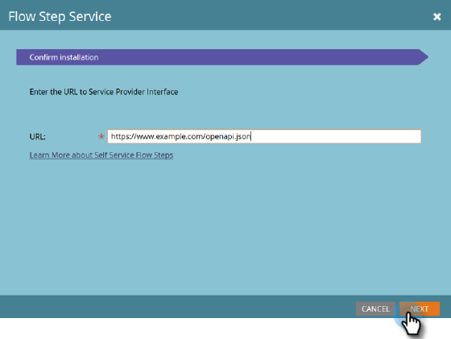
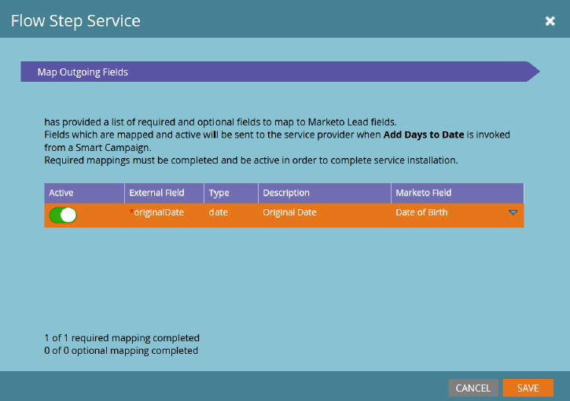
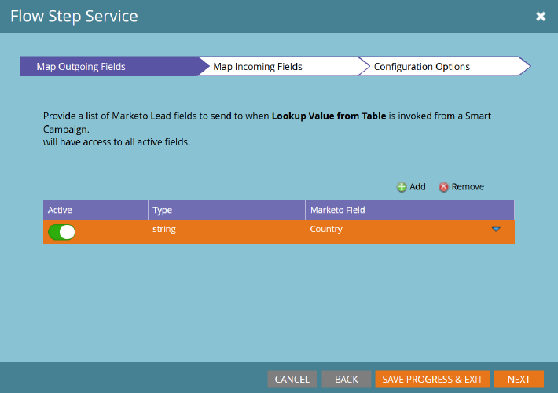
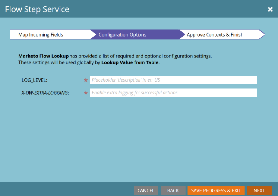
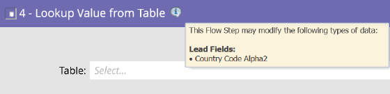

# Flödesstegstjänst {#flow-step-service}

Självbetjäningsflödessteg är ett ramverk och en uppsättning funktioner för att skapa, publicera och integrera webbtjänster i Adobe Marketo Engage Smart Campaigns. Handboken är avsedd för Marketo Engage-användare som vill installera och använda tjänster som redan har skapats och publicerats. Mer information om hur du redigerar och publicerar din egen tjänst finns i [[!DNL GitHub] databasen för Service Provider Interface](https://github.com/adobe/Marketo-SSFS-Service-Provider-Interface){target="_blank"}. En implementering av en koncepttest för sökning av tabeller finns [här](https://github.com/adobe/mkto-flow-lookup){target="_blank"}.

## Onboarding och Managing Services {#onboarding-and-managing-services}

Administratörsbehörighet krävs i Marketo för att installera ett anpassat flödessteg. Förutom installations-URL:en kan alla andra aspekter av en tjänst redigeras efter att den initiala introduktionen har slutförts genom att detaljnivån för tjänsten har hämtats från Service Providers-rutnätet.

## Installations-URL {#installation-url}

För att kunna påbörja installationen måste du först hämta URL:en för det OpenAPI-dokument som definierar tjänsten. Din tjänsteleverantör bör kunna ge dig detta och har vanligtvis en URL som slutar på `/openapi.json`. Fullständiga URL:er ser ut ungefär som `https://www.example.com/OpenAPI.json`. När du har den här URL:en går du till menyn [!UICONTROL Service Providers] i ditt [!UICONTROL Admin]-avsnitt.

Klicka på **[!UICONTROL Next]** för att gå till sektionen Ange tjänstinloggningsuppgifter.

## Ange autentiseringsuppgifter för tjänsten {#enter-service-credentials}

Marketo måste ha giltiga API-autentiseringsuppgifter för att komma åt den tjänst som installeras. Dessa inloggningsuppgifter bör du få från din tjänsteleverantör. Tjänsterna har tre olika autentiseringsalternativ, så du kan se en av tre olika autentiseringsuppgifter: **API-nyckel** som bara har ett indatafält, **Grundläggande autentisering** som kräver ett användarnamn och lösenord och kan även kräva ett fält som heter Realm, och **OAuth2** som använder _Klientautentiseringsuppgifter_ som kräver ett _klient-ID_ och _Klienthemlighet_.

När du sparar dina inloggningsuppgifter försöker Marketo anropa tjänstens statusslutpunkt för att verifiera att de är giltiga. Om de angivna autentiseringsuppgifterna är ogiltiga visas ett felmeddelande om detta.

>[!CAUTION]
>
>Om en tjänsteleverantör skapas och tas bort kan du inte återanvända dess tjänstleverantörs-, API-, utlösare- eller filternamn.

## Onboarding Guide (tillval) {#onboarding-guide}

Vissa tjänsteleverantörer kommer att inkludera ett valfritt steg i Onboarding Guide. Det här steget kommer att innehålla eventuella ytterligare instruktioner för att slutföra tjänstintroduktionen som är specifika för tjänsten.

## Fältmappning {#field-mapping}

För att kunna ta emot eller returnera data från ett visst lead-fält måste det fältet mappas. Mappning är ett obligatoriskt steg under introduktionen, men du kan alltid gå tillbaka och ändra mappningarna senare. Det finns två typer av mappningar som har konfigurerats på olika skärmar: **Utgående fält**, som skickas till tjänsten när Marketo anropar flödessteget, och **Inkommande fält**, som är fält som kan ta emot data från tjänsten när data returneras till Marketo.

>[!NOTE]
>
>Genom att mappa ett utgående fält ger du Marketo tillstånd att överföra data från det fältet som är relaterade till leads som bearbetas av den associerade tjänsten. Se till att du har rätt juridisk status och behörighet att överföra dessa data till din tjänsteleverantör, eftersom dessa fält kan innehålla personligt identifierbar information som omfattas av dataintegritetsskydd, skydd och innehavslagstiftning.

Valfria fältmappningar kan inaktiveras utan avbrott i tjänsten, men obligatoriska mappningar kan inte tas bort eller inaktiveras helt.

## Tjänststyrda mappningar {#service-driven-mappings}

Tjänster som har en fast uppsättning indata och utdata, som till exempel ett steg i händelseregistreringsflödet, använder **Tjänststyrda mappningar**. För den här typen av mappning tillhandahåller tjänsteleverantören både en datatyp och ett tips i form av ett API-namn. Om tipset matchar API-namnet för ett befintligt lead-fält fylls fältet automatiskt i i mappningsavsnittet. För fält utan matchande tips måste du fylla i mappningen manuellt från fältlistan med matchande datatyp. Mappningar som krävs måste fyllas i för att introduktionen ska kunna slutföras.

## Användarstyrda mappningar {#user-driven-mappings}

Tjänster som inte har en fast uppsättning indata och utdata, t.ex. en datumformateringstjänst, använder **användarstyrda mappningar**. Det innebär att varje inkommande och utgående fält måste konfigureras av en administratör.

## Utgående fält {#outgoing-fields}

Utgående fält är de som skickas till tjänsten Flow Step när det flödessteget används i en smart kampanj.

## Inkommande fält {#incoming-fields}

Inkommande fält är de som tjänsten Flow Step kan skriva data till.

## Konfigurationsalternativ (valfritt) {#configuration-options}

Vissa tjänster har antingen valfria eller obligatoriska globala konfigurationsalternativ. Om något av alternativen är obligatoriskt måste du ange ett värde för alla nödvändiga alternativ innan du sparar eller slutför introduktionen. Parametrar vars namn är i kursiv stil skickas till den anropade tjänsten som rubriker.

## Återkalla en tjänst {#retiring-a-service}

För att underlätta övergången till nya eller alternativa versioner av en tjänst utan att störa den aktiva användningen kan tjänster tas bort från menyn Tjänsteleverantörer. **Genom att behålla en tjänst** tas motsvarande flödessteg bort från paletten Smart Campaign-flöde, så att inga nya användningar av den kan skapas. I de flesta fall bör du ha en ersättningstjänst som är klar att ersätta den befintliga när du väljer att dra in en tjänst.

## Borttagning av tjänst {#service-deprecation}

Ibland måste tryckeriet ta bort stegvisa tjänster som en normal del av programvarans livscykel. När en tjänsteleverantör meddelar detta fylls borttagningsdatumet och meddelandet i i rutnätsvyn för tjänsteleverantörer. Om du fortsätter att använda en tjänst som har blivit inaktuell kan det leda till avbrott i tjänsten om den inte längre svarar på förväntat sätt, eller slutar ta emot begäranden från Marketo Smart Campaigns, så du bör vara uppmärksam på eventuella meddelanden om borttagning av tjänst som du får och vidta lämpliga åtgärder för att ta bort eller ersätta åtgärder från tjänsten som fortfarande används.

## Använda tredjeparts- och anpassade flödessteg {#using-third-party-and-custom-flow-steps}

Installerade flödessteg kan i stort sett användas på samma sätt som standardflödessteg. Alla flödesparametrar som definieras av tjänsten presenteras för slutanvändarna.

## Uppdaterar plocklistor {#refreshing-picklists}

Marketo kommer att uppdatera valmöjligheterna för tjänster varje kväll, men det finns tillfällen när du behöver nya alternativ, som att skapa kampanjer. Du kan enkelt uppdatera dessa från alla instanser av flödessteget med knappen Uppdatera, eller genom att gå till menyn [!UICONTROL Admin] > [!UICONTROL Service Providers] och klicka på [!UICONTROL Refresh Picklist] när du har valt tjänsten.

## Kontrollerar inkommande fält {#checking-incoming-fields}

Du kan kontrollera vilka inkommande fält som har konfigurerats för ett visst flödessteg genom att hålla muspekaren över verktygstipsikonen. Detta är användbart när du vill avgöra vilka fält som kan ändras när en lead flödar genom den, så att du kan konfigurera alternativ i efterföljande steg med dessa fält.

## Inkommande fält och ändringar av datavärden {#incoming-fields-and-data-value-changes}

Till skillnad från de flesta andra flödessteg kan de som implementeras med SSFS-ramverket skriva tillbaka data till huvudfält som mappas av en administratör och registrera dessa ändringar som aktiviteter för datavärdesändring.  När ett flödessteg skriver data på det här sättet kommer alla dessa ändringar att slutföras innan Smart Campaign går vidare till efterföljande steg, så att alla data som skrivs kan användas i efterföljande flödesstegval.

## Tjänstloggar och statistik {#service-logs-and-statistics}

Varje tjänst för flödessteg har flera typer av loggning som är kopplade till den för att hjälpa till att övervaka hälsan och felsöka problem som rör integreringen.

## Tjänststatistik {#service-statistics}

I loggen för tjänststatistik sammanställs resultaten av anrop och återanrop för varje tjänst. De grupperas efter tid, nivå (segment eller post) och kod och anger antal och det senaste loggmeddelandet för varje mottagen kod. Kontrollpanelen är främst avsedd att underlätta övervakningen av tjänsternas hälsa.
