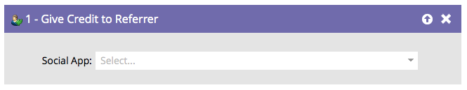

# Ge kredit till referent {#give-credit-to-referrer}

När du kör ett _hänvisningserbjudande_ eller en _utlottning_ kan du tillgodoräkna dig referenten på olika sätt:

* Genererade besök
* Refererade signeringsprogram
* **Smart List-utlösare**
* Anpassad JavaScript-händelse

Om du väljer att använda alternativet **Smart List Trigger** för att ange ett mål måste du använda flödessteget **[!UICONTROL Give Credit to Referrer]**.

1. När ni väl har skapat kampanjen och bestämt vilken åtgärd ni ska utlösa behöver ni bara hitta och välja den sociala app som ni vill tillgodoräkna er referenten.

   

   >[!NOTE]
   >
   >Kontrollera att din sociala app är konfigurerad att använda Smart List Trigger. Mer information finns i _Ange mål för hänvisningserbjudande_.

Underbar! Alla som bearbetas av det här flödessteget kommer nu att tillgodoräkna sig sin referent.
