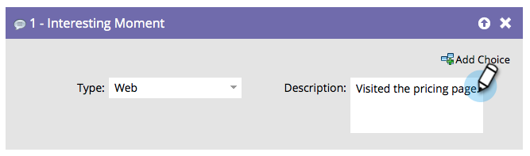

# Intressant stund {#interesting-moment}

Om du har Marketo Sales Insight kan du använda flödessteget **Intressant stund** för att ge säljteamet insyn i de coola saker som medarbetarna gör.

1. Markera den intressanta stund **[!UICONTROL type]** som du vill använda.

   

1. Skapa en **[!UICONTROL description]** som förklarar det intressanta ögonblicket för ditt säljteam.

   

   >[!TIP]
   >
   >_Mindre är mer_. Samarbeta med säljarna för att se till att intressanta ögonblick faktiskt blir intressanta.

Du kan också använda [tokens i intressanta stunder](/help/marketo/product-docs/marketo-sales-insight/msi-for-salesforce/features/tabs-in-the-msi-panel/interesting-moments/trigger-tokens-for-interesting-moments.md){target="_blank"} för att göra verkligt användbara dynamiska beskrivningar.

>[!MORELIKETHIS]
>
>* [Använda intressanta stunder](/help/marketo/product-docs/marketo-sales-insight/msi-for-salesforce/features/tabs-in-the-msi-panel/interesting-moments/using-interesting-moments.md){target="_blank"}
>* [Tokens för intressanta ögonblick](/help/marketo/product-docs/marketo-sales-insight/msi-for-salesforce/features/tabs-in-the-msi-panel/interesting-moments/trigger-tokens-for-interesting-moments.md){target="_blank"}
