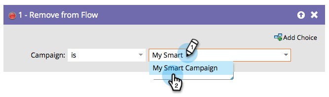

# Ta bort från flöde {#remove-from-flow}

Tänk dig att du har ett smart kampanjflöde som använder&quot;Skicka avisering&quot; för att påminna en säljare om att ringa en aktiv potentiell kund. Det skickar ett meddelande varje dag tills rektorn ringer. Du kan använda Ta bort från flöde i en utlösarkampanj när den potentiella kunden har kontaktats för att stoppa ytterligare aviseringar. Det är som en smart kampanjprojektorplats för en person.

>[!NOTE]
>
>Detta påverkar normalt personer som sitter i ett kampanjflödes väntesteg.

## Översikt {#overview}

Du kan ta bort personer från ett kampanjflöde genom att använda flödessteget **Ta bort från flöde** .

## Användning {#usage}

Hitta och välj den smarta kampanj som du vill ta bort personer från.

>[!NOTE]
>
>Du kan välja en specifik smart kampanj eller välja den här kampanjen i listrutan **Campaign** för att välja den kampanj du befinner dig i just nu.

>[!NOTE]
>
>**Påminnelse**
>
>Den här funktionen är avsedd att användas i flödesstegen i en smart kampanj.

