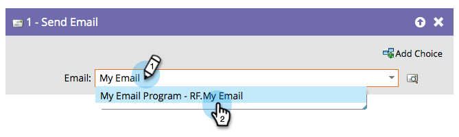

# Skicka e-post {#send-email}

Flödessteget [!UICONTROL Send Email] kan användas som en del av kampanjer eller som ett enda flödessteg för att skicka e-post till dina medarbetare.

Du kan förhandsgranska det valda e-postmeddelandet direkt från flödessteget.

1. Sök efter och välj det e-postmeddelande som du vill skicka.

   

   >[!NOTE]
   >
   >Din e-postadress måste godkännas om du vill välja den i flödessteget.

1. Klicka på förhandsgranskningsikonen för att visa det markerade e-postmeddelandet.

   

En ny flik/ett nytt fönster öppnas där du kan se e-postmeddelandet.
