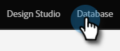
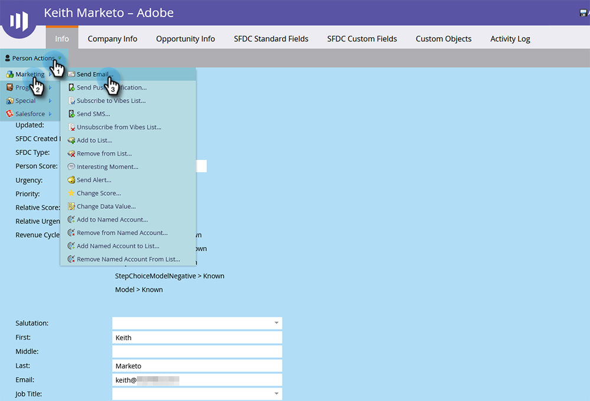

# Enstaka flödesåtgärder från personinformationssidan {#single-flow-actions-from-person-detail-page}

Förutom att köra enskilda flödesåtgärder från en smart lista kan du även köra dem direkt på en personinformationssida.

1. Klicka **Databas**.

   

1. Leta reda på den önskade personen.

   

1. Klicka på **Personåtgärder** och välj önskat flödessteg. I det här exemplet kommer vi att använda [Skicka e-post](/help/marketo/product-docs/core-marketo-concepts/smart-campaigns/flow-actions/send-email.md).

   

1. Välj önskad e-postadress och klicka på **Kör nu**.

   

>[!NOTE]
>
>Om instansen innehåller arbetsytor/partitioner och du navigerar direkt till en personinformationssida (dvs. via länk) i stället för att komma från en sida/resurs som är kopplad till en arbetsyta, måste du också välja en arbetsyta i steg 4.
