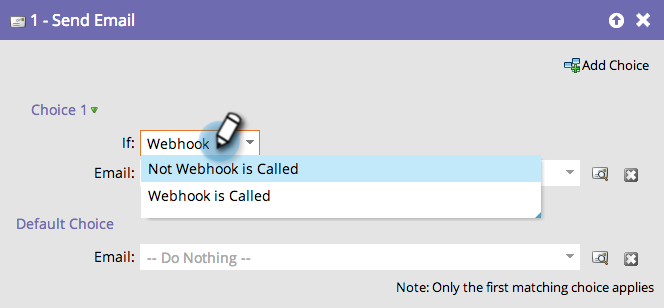

# Använda en webkrok i en smart kampanj {#use-a-webhook-in-a-smart-campaign}

Om du vill använda en [webkrok](http://developers.marketo.com/documentation/webhooks/)lägger du till den i en [smart kampanj](add-a-flow-step-to-a-smart-campaign.md) som en flödesåtgärd.

>[!NOTE]
>
>**Tillgänglighet**
>
>Alla kunder har inte köpt den här funktionen. Kontakta din säljare för mer information.

1. [Skapa en smart kampanj](../../../../product-docs/core-marketo-concepts/smart-campaigns/creating-a-smart-campaign/create-a-new-smart-campaign.md).

   >[!NOTE]
   >
   >Webhooks kan bara användas i utlösarkampanjer.

1. Gå till fliken **Flöde** och dra i åtgärden **Anropa webkrok** -flöde.

   

1. Välj Webkrok.

   

1. Du kan också använda Webhooks i en smart lista.

   

1. Slutligen kan du använda Webhooks i **Add Choice** i ett flödessteg.

   

