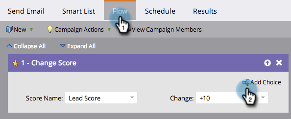
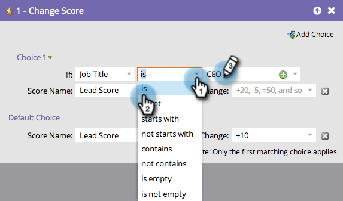
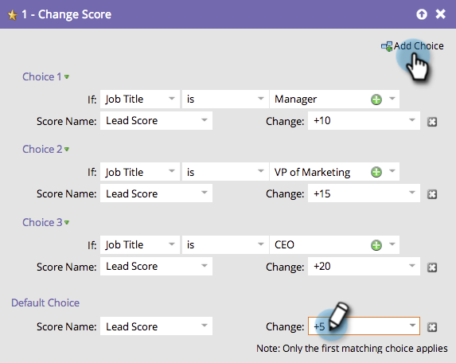

# Använd Lägg till alternativ i ett flödessteg {#use-add-choice-in-a-flow-step}

>[!PREREQUISITES]
>
>[Lägg till ett flödessteg i en smart kampanj](/help/marketo/product-docs/core-marketo-concepts/smart-campaigns/flow-actions/add-a-flow-step-to-a-smart-campaign.md){target="_blank"}

Med Lägg till alternativ kan du använda ett flödessteg och säga att det är beroende när du väljer detaljerna.

1. Lägg till ett flödessteg på fliken **[!UICONTROL Flow]** i den smarta kampanjen och klicka sedan på **[!UICONTROL Add Choice]**.

   

1. Välj önskat villkor.

   

1. Välj önskad operator och ange ett valvärde. Detta ställer in kriterier eller val.

   

1. Ange ett flödesstegvärde för valet.

   

   >[!CAUTION]
   >
   >Token _fungerar inte_ i villkorsdelen av ett urvalsflödessteg.

1. Upprepa stegen ovan för att lägga till flera alternativ och lägg sedan till/justera standardvärdet.

   

   >[!TIP]
   >
   >Du kan ange att något av dina flödessteg ska vara —Do None—. I så fall kommer ingen åtgärd att utföras.

   >[!CAUTION]
   >
   >Endast det första matchande alternativet används för flödessteget. Lär dig hur du [ändrar ordning på&quot;Lägg till val&quot; i en flödesåtgärd](/help/marketo/product-docs/core-marketo-concepts/smart-campaigns/flow-actions/reorder-add-choice-in-a-flow-step.md){target="_blank"}.

   Bra! Nu kan ni skapa en enda smart kampanj med flödesstegalternativ i stället för att skapa flera smarta kampanjer för varje val.

   >[!MORELIKETHIS]
   >
   >[Ändra ordning på Lägg till alternativ i ett flödessteg](/help/marketo/product-docs/core-marketo-concepts/smart-campaigns/flow-actions/reorder-add-choice-in-a-flow-step.md){target="_blank"}
