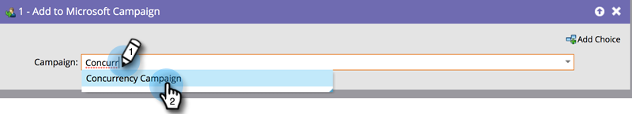

# Lägg till eller ta bort personer från Dynamics-kampanjen {#add-or-remove-people-from-your-dynamics-campaign}

## Lägg till i Dynamics Campaign {#add-to-dynamics-campaign}

Det här flödessteget kan användas i Marketo Smart Campaigns för att lägga till personer som leads eller kontakter i en Microsoft-kampanj. Om leadet ännu inte finns i Dynamics synkroniseras det automatiskt och läggs till i kampanjen.

>[!NOTE]
>
>Denna flödesåtgärd är endast tillgänglig för utlösarkampanjer.

I den smarta kampanjen söker du efter och väljer den Dynamics-kampanj som du vill lägga till dina medarbetare i.

>[!NOTE]
>
>Om du inte kan se en Dynamics-kampanj i kampanjlistan:
>
>* Kontrollera att kampanjsynkroniseringen fungerar
>* Kampanjen är inte aktiv i Microsoft Dynamics

Systemet skapar automatiskt en kampanjspecifik statisk marknadsföringslista, var och en för leads och kontakter, som personen ska läggas till i. Det är en engångsåtgärd och en gång för efterföljande synkroniseringar till kampanjen används samma marknadsföringslista. Den namngivningsstandard som används för det statiska namnet på marknadsföringslistan är `Mkto-leads-<uniqueID>` för leads och `Mkto-contacts-<uniqueID>` för kontakter.

Om dessa Marketo-genererade marknadsföringslistor kopplas till andra kampanjer kan det leda till förvirrande beteende. Till exempel: om ni lägger till ytterligare en kampanj skulle det också leda till att den andra kampanjen läggs till. Vi rekommenderar inte heller att den Marketo-genererade marknadsföringslistan kopplas bort från Campaign i Dynamics.

## Ta bort från Dynamics Campaign {#remove-from-dynamics-campaign}

Det här flödessteget kan användas i Marketo Smart Campaigns för att ta bort personer från en Microsoft-kampanj. Detta tar endast bort leads från en kampanj som tidigare har lagts till i Campaign via flödesåtgärden&quot;Tillagd i Microsoft Campaign&quot;.

>[!NOTE]
>
>Denna flödesåtgärd är endast tillgänglig för utlösarkampanjer.

I den smarta kampanjen söker du efter och väljer den Dynamics-kampanj som du vill ta bort dina medarbetare från.

>[!NOTE]
>
>Om du inte ser någon Dynamics-kampanj i kampanjlistan:
>
>* Kontrollera att kampanjsynkroniseringen fungerar
>* Kampanjen är inte aktiv i Microsoft Dynamics

