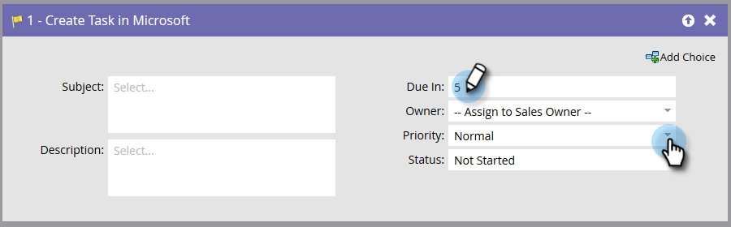

# Skapa uppgift i Microsoft {#create-task-in-microsoft}

Som marknadsförare har ni information som kan hjälpa försäljningen att sluta avtal. Du kan skapa uppgifter för att tala om för dem vad de ska göra och när de ska göra det.

Skapa uppgift i Microsoft skapar en aktivitet under Aktiviteter som är relaterade till personen (lead eller kontakt) i [!DNL Microsoft].

>[!NOTE]
>
>Det här flödessteget _fungerar bara när det används med utlösare_, inte filter, i din smarta kampanj.

Som standard ser flödessteget ut så här:

>[!NOTE]
>
>När Marketo Sync User skapar uppgifter är **[!UICONTROL Due In]** ett obligatoriskt fält för uppgiften som ska skapas i [!DNL Microsoft]. Marketo anger fem dagar som standard om inget värde anges.

Anpassa alla fält för att skapa uppgiften som du vill.

>[!NOTE]
>
>Fältet Status som har angetts för aktiviteten i Flow Action uppdaterar fältet: Statusorsak i [!DNL Microsoft].

>[!TIP]
>
>Du kan använda `{{lead.tokens}}`, `{{company.tokens}}`, `{{campaign.tokens}}` och `{{system.tokens}}` i **[!UICONTROL Subject]** och **[!UICONTROL Description]**. Mer information finns i [Token för flödessteg](/help/marketo/product-docs/core-marketo-concepts/smart-campaigns/flow-actions/use-tokens-in-flow-steps.md){target="_blank"}.
