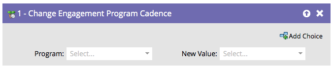

# Change Engagement Program Cadence {#change-engagement-program-cadence}

När en person har vårdats av ett engagemangsprogram kan du tillfälligt pausa vården åt dem med det här flödessteget.

>[!NOTE]
>
>Om en person inte är medlem i programmet och går igenom det här flödessteget läggs de automatiskt till som medlem och i den första strömmen.

1. Välj engagemangsprogrammet.

   

1. Välj **[!UICONTROL Paused]** som **[!UICONTROL New Value]** om du vill hindra personen från att ta emot innehåll.

   

Du kan återställa personen till **[!UICONTROL Normal]** om du vill att personen ska börja ta emot innehåll igen.
