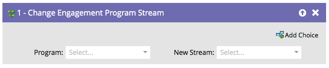

# Change Engagement Program Stream {#change-engagement-program-stream}

## Översikt {#overview}

Normalt använder du [regler för direktövergång](/help/marketo/product-docs/email-marketing/drip-nurturing/engagement-program-streams/transition-people-between-engagement-streams.md) för att uppnå detta, men om du vill flytta personer från en ström till en annan manuellt är det här flödessteget som ska användas.

## Användning {#usage}

1. Välj det engagemangsprogram som du vill flytta personen till.

   >[!NOTE]
   >
   >Om du väljer ett annat program lämnas personen kvar i den aktuella strömmen och läggs till i den nya.

   

1. Markera den ström du vill lägga till dina personer i.

   

Och det är allt!
