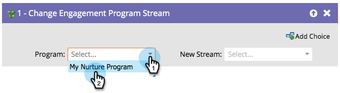

# Change Engagement Program Stream {#change-engagement-program-stream}

Normalt använder du [flödesövergångsregler](/help/marketo/product-docs/email-marketing/drip-nurturing/engagement-program-streams/transition-people-between-engagement-streams.md) för att uppnå detta. Men om du vill flytta personer manuellt från en ström till en annan, är det här flödessteget som ska användas.

1. Välj det engagemangsprogram som du vill flytta personen till.

   >[!NOTE]
   >
   >Om du väljer ett annat program lämnas personen kvar i den aktuella strömmen och läggs till i den nya.

   

1. Markera den ström du vill lägga till dina personer i.

   

Och det är allt!
