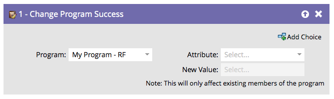

# Programmet har ändrats {#change-program-success}

Om du någon gång har en grupp personer som markerats felaktigt med Programslutfört, kan du använda det här flödessteget för att ange värdet true eller false för Framgången.

1. När du drar i det här flödessteget ställs programmet automatiskt in på det program som innehåller den smarta kampanj som du redigerar.

   >[!NOTE]
   >
   >Endast programmedlemmar påverkas.

   

1. Välj **[!UICONTROL Success]** eller **[!UICONTROL Success Date]** som attribut.

   

   >[!NOTE]
   >
   >Om du anger [!UICONTROL Success Date] till vad som helst anges värdet true automatiskt för Slutfört. Om du anger [!UICONTROL Success] som true anges automatiskt datum för slutförande till aktuellt datum.

1. Ange **[!UICONTROL New Value]** till **[!UICONTROL True]** eller **[!UICONTROL False]**.

   

   >[!TIP]
   >
   >Du kan använda flödessteget två gånger för att ange både flaggan Slutfört och datumet.

Bra! Nu vet du hur man kan ångra och tvinga fram framgång.
